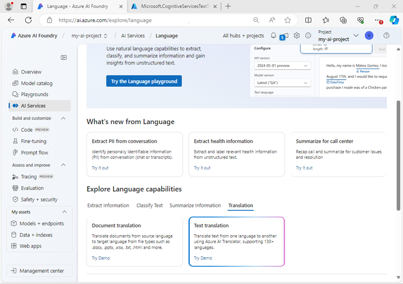

---
lab:
  title: Vorbereiten eines KI-Entwicklungsprojekts
  description: 'Erfahren Sie, wie Sie Cloudressourcen in Hubs und Projekten organisieren, um Entwicklerinnen und Entwickler bei der Erstellung von KI-Lösungen zu unterstützen.'
---

# Vorbereiten eines KI-Entwicklungsprojekts

In dieser Übung verwenden Sie das Azure AI Foundry-Portal, um einen Hub und ein Projekt zu erstellen, das für ein Team von Entwickelnden bereit ist, eine KI-Lösung zu erstellen.

Diese Übung dauert ca. **30** Minuten.

## Öffnen des Azure KI Foundry-Portals

Beginnen wir mit der Anmeldung im Azure AI Foundry-Portal.

1. Öffnen Sie in einem Webbrowser unter `https://ai.azure.com` das [Azure KI Foundry-Portal](https://ai.azure.com) und melden Sie sich mit Ihren Azure-Anmeldeinformationen an. Schließen Sie alle Tipps oder Schnellstartbereiche, die beim ersten Anmelden geöffnet werden, und verwenden Sie bei Bedarf das **Azure AI Foundry-Logo** oben links, um zur Startseite zu navigieren, die ähnlich wie die folgende Abbildung aussieht:

    

1. Prüfen Sie die Informationen auf der Startseite.

## Erstellen eines Hubs und eines Projekts

Ein Azure KI-*Hub* bietet einen kollaborativen Arbeitsbereich, in dem Sie ein oder mehrere *Projekte* definieren können. Wir erstellen ein Projekt und einen Azure KI-Hub und überprüfen die Azure-Ressourcen, die erstellt werden, um sie zu unterstützen.

1. Wählen Sie auf der Startseite **+ Projekt erstellen**.
1. Geben Sie im **Assistenten zum Erstellen eines Projekts** einen geeigneten Projektnamen für (z. B. `my-ai-project`) ein und überprüfen Sie dann die Azure-Ressourcen, die automatisch erstellt werden, um Ihr Projekt zu unterstützen.
1. Wählen Sie **Anpassen** aus und legen Sie die folgenden Einstellungen für Ihren Hub fest:
    - **Hubname**: *Ein eindeutiger Name – z. B. `my-ai-hub`.*
    - **Abonnement:** *Geben Sie Ihr Azure-Abonnement an.*
    - **Ressourcengruppe**: *Erstellen Sie eine neue Ressourcengruppe mit einem eindeutigen Namen (z.B. `my-ai-resources`), oder wählen Sie eine bestehende aus.*
    - **Standort**: Wählen Sie **Hilfe bei der Auswahl** aus, wählen Sie dann **gpt-4** im Fenster der Standorthilfe aus und verwenden Sie die empfohlene Region\*.
    - **Verbinden von Azure KI Services oder Azure OpenAI**: *Erstellen Sie eine neue KI Services-Ressource mit einem geeigneten Namen (z.B. `my-ai-services`) oder verwenden Sie eine vorhandene.*
    - **Azure KI-Suche verbinden**: Verbindung überspringen

    > \* Azure OpenAI-Ressourcen werden auf Mandantenebene durch regionale Kontingente eingeschränkt. Wenn später in der Übung ein Kontingentlimit erreicht wird, besteht eventuell die Möglichkeit, eine andere Ressource in einer anderen Region zu erstellen.

1. Klicken Sie auf **Weiter**, um Ihre Konfiguration zu überprüfen. Klicken Sie auf **Erstellen** und warten Sie, bis der Vorgang abgeschlossen ist.
1. Sobald Ihr Projekt erstellt wurde, schließen Sie alle angezeigten Tipps und überprüfen Sie die Projektseite im Azure AI Foundry-Portal, die in etwa wie in der folgenden Abbildung aussehen sollte:

    

1. Wählen Sie im unteren linken Navigationsbereich die Option **Verwaltungszentrum** aus. Im Verwaltungszentrum können Sie Einstellungen sowohl auf *Hub-* als auch auf *Projekt-* Ebene festlegen, die beide im Navigationsbereich angezeigt werden.

    

    Beachten Sie, dass Sie im Navigationsbereich auf den folgenden Seiten Ressourcen auf Hub- und Projektebene anzeigen und verwalten können:

    - Übersicht
    - Benutzer
    - Modelle und Endpunkte
    - Verbundene Ressourcen
    - Compute (*nur auf Hub-Ebene*)

    > **Hinweis**: Je nach den Berechtigungen, die Ihrer Entra-ID in Ihrem Azure-Mandanten zugewiesen sind, können Sie möglicherweise keine Ressourcen auf Hub-Ebene verwalten.

1. Wählen Sie im Navigationsbereich im Abschnitt für Ihren Hub die Seite **Übersicht** aus, um Details zu Ihrem Hub anzuzeigen. 
1. Wählen Sie im Bereich **Hub-Eigenschaften** den Link zu der mit dem Hub verbundenen Ressourcengruppe, um eine neue Browserregisterkarte zu öffnen und zum Azure-Portal zu navigieren. Melden Sie sich mit Ihren Azure-Anmeldeinformationen an, wenn Sie dazu aufgefordert werden.
1. Rufen Sie die Ressourcengruppe im Azure-Portal auf, um die Azure-Ressourcen anzuzeigen, die zur Unterstützung Ihres Hubs und Projekts erstellt wurden.

    

    Beachten Sie, dass die Ressourcen in der Region erstellt wurden, die Sie beim Erstellen des Hubs ausgewählt haben.

## Hinzufügen einer verbundenen Ressource

Angenommen, Ihr Projekt benötigt Zugriff auf eine zweite **Azure KI Services-Ressource** in einer anderen Region.

1. Wählen Sie im Azure-Portal auf der Seite für Ihre Ressourcengruppe **+ Erstellen** aus und suchen Sie nach `Azure AI Services`. Wählen Sie in den Ergebnissen die Multi-Service-Ressource **Azure KI Services** aus, wie in der folgenden Abbildung dargestellt:

    

1. Erstellen Sie eine neue **Azure KI Services**-Ressource mit den folgenden Einstellungen:
    - **Abonnement:** *Geben Sie Ihr Azure-Abonnement an.*
    - **Ressourcengruppe**: *Die Ressourcengruppe mit Ihren vorhandenen Azure AI Foundry-Ressourcen.*
    - **Region**: *Auswahl einer beliebigen verfügbaren Region, die nicht diejenige ist, in der sich Ihre vorhandenen Ressourcen befinden*
    - **Name**: *Ein eindeutiger Name*
    - **Tarif**: Standard S0.
1. Warten Sie, bis die Ressource „KI-Dienste“ erstellt wurde.
1. Kehren Sie zur Browserregisterkarte des Azure AI Foundry-Portals zurück und sehen Sie sich in der Ansicht **Verwaltungszentrum** im Navigationsbereich im Abschnitt für Ihr *<u>Projekt</u>* die Seite **Verbundene Ressourcen** an. Die vorhandenen verbundenen Ressourcen in Ihrem Projekt werden aufgelistet.

    

1. Wählen Sie **+ Neue Verbindung** und wählen Sie den Ressourcentyp **Azure KI Services**. Durchsuchen Sie dann die verfügbaren Ressourcen, um die KI Services-Ressource zu finden, die Sie im Azure-Portal erstellt haben, und verwenden Sie die Schaltfläche **Verbindung hinzufügen**, um sie zu Ihrem Projekt hinzuzufügen.

    

1. Wenn die neue Ressource verbunden ist, schließen Sie das Dialogfeld **Azure KI Services-Ressourcen verbinden** und überprüfen Sie, ob die neuen verbundenen Ressourcen für Azure KI Services und Azure OpenAI Service aufgelistet sind.

## Entdecken von KI Services

Ihr Azure AI Foundry-Projekt hat Zugriff auf Azure KI Services. Probieren wir das im Portal aus.

1. Wählen Sie auf der Verwaltungszentrumsseite im Navigationsbereich unter Ihrem Projekt die Option **Zum Projekt wechseln**.
1. Wählen Sie im Navigationsbereich Ihres Projekts **KI Services** und wählen Sie die Kachel **Sprache und Übersetzer**.

    

1. Im Abschnitt **Sprachenfunktionen erkunden** sehen Sie sich die Registerkarte **Übersetzung** an und wählen **Textübersetzung**.

    

1. Auf der Seite **Textübersetzung**, im Abschnitt **Ausprobieren**, sehen Sie sich die Registerkarte **Mit eigenen Daten testen** an.
1. Wählen Sie eine Ihrer Azure KI Services-Ressourcen aus, und übersetzen Sie dann Text (z. B. `Hello world`) aus einer Sprache in eine andere.

    

## Bereitstellen und Testen eines generativen KI-Modells

Ihr Projekt enthält auch verbundene Ressourcen für Azure OpenAI, mit denen Sie Azure OpenAI-Sprachmodelle verwenden können, um generative KI-Lösungen zu implementieren.

1. Wählen Sie im linken Fensterbereich für Ihr Projekt im Abschnitt **Meine Assets** die Seite **Modelle + Endpunkte**.
1. Wählen Sie auf der Seite **Modelle + Endpunkte** auf der Registerkarte **Modellbereitstellungen** im Menü **+ Modell bereitstellen** die Option **Basismodell bereitstellen**.
1. Suchen Sie das Modell **gpt-4** in der Liste, wählen Sie es aus und bestätigen Sie es.
1. Stellen Sie das Modell mit den folgenden Einstellungen bereit, indem Sie **Anpassen** in den Bereitstellungsdetails wählen:
    - **Bereitstellungsname**: *Ein eindeutiger Name für Ihre Modellbereitstellung, zum Beispiel `gpt-4-model`.*
    - **Bereitstellungstyp**: Standard
    - **Modellversion**: *Wählen Sie die Standardversion aus.*
    - **Verbundene KI-Ressource**: *Wählen Sie eine Ihrer Azure OpenAI-Ressourcenverbindungen aus.*
    - **Ratenbegrenzung für Token pro Minute (Tausender)**: 5.000
    - **Inhaltsfilter**: StandardV2 
    - **Dynamische Quote aktivieren**: Deaktiviert
      
    > **Hinweis:** Durch das Verringern des TPM wird die Überlastung des Kontingents vermieden, das in dem von Ihnen verwendeten Abonnement verfügbar ist. 5.000 TPM reicht für die in dieser Übung verwendeten Daten aus.

1. Nachdem das Modell bereitgestellt wurde, wählen Sie auf der Seite „Bereitstellungsübersicht“ die Option **Im Playground öffnen** aus.
1. Stellen Sie auf der Seite **Chat-Playground** sicher, dass Ihre Modellimplementierung im Abschnitt **Bereitstellung** ausgewählt ist.
1. Geben Sie im Chat-Fenster eine Abfrage wie `How can I use Azure AI Services in a software development project?` ein und sehen Sie sich die Antwort an:

    

## Zusammenfassung

In dieser Übung haben Sie Azure AI Foundry untersucht und erfahren, wie Sie Hubs und Projekte erstellen und verwalten, verbundene Ressourcen hinzufügen und Azure KI Services und Azure OpenAI-Modelle im Azure AI Foundry-Portal erkunden.

## Bereinigen

Wenn Sie die Erkundung des Azure KI-Foundry-Portals abgeschlossen haben, sollten Sie die Ressourcen, die Sie in dieser Übung erstellt haben, löschen, um unnötige Azure-Kosten zu vermeiden.

1. Kehren Sie zu der Browserregisterkarte zurück, die das Azure-Portal enthält (oder öffnen Sie das [Azure-Portal](https://portal.azure.com) unter `https://portal.azure.com` erneut in einer neuen Browserregisterkarte) und sehen Sie sich den Inhalt der Ressourcengruppe an, in der Sie die in dieser Übung verwendeten Ressourcen bereitgestellt haben.
1. Wählen Sie auf der Symbolleiste die Option **Ressourcengruppe löschen** aus.
1. Geben Sie den Namen der Ressourcengruppe ein, und bestätigen Sie, dass Sie sie löschen möchten.
