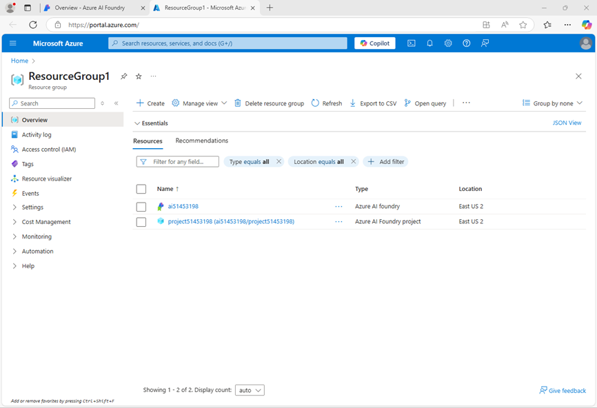

---
lab:
  title: Vorbereiten eines KI-Entwicklungsprojekts
  description: 'Erfahren Sie, wie Sie Cloudressourcen in Azure AI Foundry-Projekten organisieren, um Entwickler bei der Erstellung von KI-Lösungen zu unterstützen.'
---

# Vorbereiten eines KI-Entwicklungsprojekts

In dieser Übung erstellen Sie mithilfe des Azure AI Foundry-Portals ein Projekt, das für die Entwicklung einer KI-Lösung vorbereitet ist.

Diese Übung dauert ca. **30** Minuten.

> **Hinweis**: Einige der in dieser Übung verwendeten Technologien befinden sich in der Vorschau oder in der aktiven Entwicklung. Es kann zu unerwartetem Verhalten, Warnungen oder Fehlern kommen.

## Öffnen des Azure KI Foundry-Portals

Beginnen wir mit der Anmeldung im Azure AI Foundry-Portal.

1. Öffnen Sie in einem Webbrowser unter `https://ai.azure.com` das [Azure KI Foundry-Portal](https://ai.azure.com) und melden Sie sich mit Ihren Azure-Anmeldeinformationen an. Schließen Sie alle Tipps oder Schnellstartfenster, die bei der ersten Anmeldung geöffnet werden, und verwenden Sie gegebenenfalls das Logo **Azure AI Foundry** oben links, um zur Startseite zu navigieren, die ähnlich wie die folgende Abbildung aussieht (schließen Sie das **Hilfe**-Fenster, falls es geöffnet ist):

    

1. Prüfen Sie die Informationen auf der Startseite.

## Erstellen eines Projekts

Ein *Azure KI-Projekt* bietet einen Arbeitsbereich für die KI-Entwicklung. Beginnen wir damit, ein Modell auszuwählen, mit dem wir arbeiten möchten, und ein Projekt zu erstellen, in dem wir es verwenden möchten.

> **Hinweis**: KI Foundry-Projekte können auf einer *Azure AI Foundry-Ressource* basieren, die Zugriff auf KI-Modelle (einschließlich Azure OpenAI), Azure AI-Dienste und andere Ressourcen für die Entwicklung von KI-Agents und Chatlösungen bietet. Alternativ können Projekte auf *KI-Hub*-Ressourcen basieren, die Verbindungen zu Azure-Ressourcen für sichere Speicherung, Rechenleistung und spezialisierte Tools umfassen. Azure AI Foundry-basierte Projekte eignen sich hervorragend für Fachkräfte in der Entwicklung, die Ressourcen für die Entwicklung von KI-Agents oder Chat-Apps verwalten möchten. KI-Hub-basierte Projekte eignen sich besser für Enterprise-Entwicklungsteams, die an komplexen KI-Lösungen arbeiten.

1. Suchen Sie auf der Startseite im Abschnitt **Modelle und Funktionen erkunden** nach dem Modell `gpt-4o`, das wir in unserem Projekt verwenden werden.
1. Wählen Sie in den Suchergebnissen das Modell **gpt-4o** aus, um dessen Details anzuzeigen, und wählen Sie dann oben auf der Seite für das Modell die Option **Dieses Modell verwenden** aus.
1. Wenn Sie zum Erstellen eines Projekts aufgefordert werden, geben Sie einen gültigen Namen für Ihr Projekt ein und erweitern Sie **Erweiterte Optionen**.
1. Wählen Sie **Anpassen** aus und legen Sie die folgenden Einstellungen für Ihr Projekt fest:
    - **Azure KI Foundry-Ressource**: *Ein gültiger Name für Ihre Azure KI Foundry-Ressource*
    - **Abonnement:** *Geben Sie Ihr Azure-Abonnement an.*
    - **Ressourcengruppe**: *Erstellen Sie eine Ressourcengruppe, oder wählen Sie eine Ressourcengruppe aus*.
    - **Region**: Wählen Sie die **empfohlene AI Foundry-Instanz aus***\*

    > \* Einige Azure KI-Ressourcen unterliegen regionalen Modellkontingenten. Sollte im weiteren Verlauf der Übung eine Kontingentgrenze überschritten werden, müssen Sie möglicherweise eine weitere Ressource in einer anderen Region anlegen.

1. Klicken Sie auf **Erstellen**, und warten Sie, bis das Projekt erstellt wird. Stellen Sie bei entsprechender Aufforderung das gpt-4o-Modell mithilfe des Bereitstellungstyps **Globaler Standard** bereit, und passen Sie die Bereitstellungsdetails an, um für **Ratenbegrenzung für Token pro Minute** den Wert „50.000“ (oder den maximal verfügbaren Wert, wenn er weniger als 50.000 beträgt) festzulegen.

    > **Hinweis:** Durch das Verringern des TPM wird die Überlastung des Kontingents vermieden, das in dem von Ihnen verwendeten Abonnement verfügbar ist. 50.000 TPM sollten für die in dieser Übung verwendeten Daten ausreichend sein. Wenn Ihr verfügbares Kontingent darunter liegt, können Sie die Übung zwar durchführen, aber es können Fehler auftreten, wenn das Kontingent überschritten wird.

1. Wenn Ihr Projekt erstellt wird, wird der Chat-Playground automatisch geöffnet, damit Sie Ihr Modell testen können:

    

1. Wählen Sie im Navigationsbereich auf der linken Seite **Übersicht**, um die Hauptseite Ihres Projekts anzuzeigen, die wie folgt aussieht:

    

1. Wählen Sie im unteren linken Navigationsbereich die Option **Verwaltungszentrum** aus. Im Verwaltungszentrum können Sie Einstellungen sowohl auf *Ressourcen-* als auch auf *Projekt-* Ebene festlegen, die beide im Navigationsbereich angezeigt werden.

    

    Die *Ressourcenebene* bezieht sich auf die **Azure AI Foundry-Ressource**, die erstellt wurde, um Ihr Projekt zu unterstützen. Diese Ressource umfasst Verbindungen mit Azure AI Services und Azure AI Foundry-Modellen; und bietet einen zentralen Ort zum Verwalten des Benutzerzugriffs auf KI-Entwicklungsprojekte.

    Die *Projektebene* bezieht sich auf Ihr einzelnes Projekt, in dem Sie projektspezifische Ressourcen hinzufügen und verwalten können.

1. Wählen Sie im Navigationsbereich im Abschnitt für Ihre Azure AI Foundry-Ressource die Seite **Übersicht** aus, um die Details anzuzeigen.
1. Wählen Sie den Link zur **Ressourcengruppe** aus, die mit der Ressource verknüpft ist, um einen neuen Browser-Tab zu öffnen und zum Azure-Portal zu navigieren. Melden Sie sich mit Ihren Azure-Anmeldeinformationen an, wenn Sie dazu aufgefordert werden.
1. Zeigen Sie die Ressourcengruppe im Azure-Portal an, um die Azure-Ressourcen anzuzeigen, die zur Unterstützung Ihrer Azure AI Foundry-Ressource und Ihres Projekts erstellt wurden.

    

    Bitte beachten Sie, dass die Ressourcen in der Region erstellt wurden, die Sie beim Erstellen des Projekts ausgewählt haben.

1. Schließen Sie die Azure-Portal-Registerkarte und kehren Sie zum Azure AI Foundry-Portal zurück.

## Überprüfen von Projektendpunkten

Das Azure AI Foundry-Projekt enthält eine Reihe von *Endpunkten*, mit denen Clientanwendungen eine Verbindung mit dem Projekt sowie den Modellen und KI-Diensten herstellen können, die es umfasst.

1. Wählen Sie auf der Verwaltungszentrumsseite im Navigationsbereich unter Ihrem Projekt die Option **Zur Ressource wechseln**.
1. Rufen Sie auf der Seite **Übersicht** des Projekts den Abschnitt **Endpunkte und Schlüssel** auf, der die Endpunkte und Autorisierungsschlüssel enthält, die Sie in Ihrem Anwendungscode für den Zugriff verwenden können:
    - Das Azure AI Foundry-Projekt und alle darin bereitgestellten Modelle.
    - Azure OpenAI in Azure AI Foundry-Modellen
    - Azure KI Services

## Testen des generativen KI-Modells

Nachdem Sie nun etwas über die Konfiguration Ihres Azure AI Foundry-Projekts wissen, können Sie zum Chat-Playground zurückkehren, um das von Ihnen bereitgestellte Modell zu erkunden.

1. Wählen Sie im Navigationsbereich links für Ihr Projekt die Option **Playgrounds** aus. 
1. Öffnen Sie den **Chat-Playground** und stellen Sie sicher, dass Ihre **GPT-4o** Modellbereitstellung im Abschnitt **Bereitstellung** ausgewählt ist.
1. Geben Sie im Bereich **Setup** in das Feld **Geben Sie dem Modell Anweisungen und Kontext** die folgenden Anweisungen:

    ```
   You are a history teacher who can answer questions about past events all around the world.
    ```

1. Übernehmen Sie die Änderungen, um die Systemmeldung zu aktualisieren.
1. Geben Sie im Chat-Fenster eine Abfrage wie `What are the key events in the history of Scotland?` ein und sehen Sie sich die Antwort an:

    

## Zusammenfassung

In dieser Übung haben Sie Azure AI Foundry kennengelernt und erfahren, wie Sie Projekte und die zugehörigen Ressourcen erstellen und verwalten können.

## Bereinigen

Wenn Sie die Erkundung des Azure KI-Foundry-Portals abgeschlossen haben, sollten Sie die Ressourcen, die Sie in dieser Übung erstellt haben, löschen, um unnötige Azure-Kosten zu vermeiden.

1. Öffnen Sie das [Azure-Portal](https://portal.azure.com) unter `https://portal.azure.com`, und zeigen Sie den Inhalt der Ressourcengruppe an, in der Sie die in dieser Übung verwendeten Ressourcen bereitgestellt haben.
1. Wählen Sie auf der Symbolleiste die Option **Ressourcengruppe löschen** aus.
1. Geben Sie den Namen der Ressourcengruppe ein, und bestätigen Sie, dass Sie sie löschen möchten.
