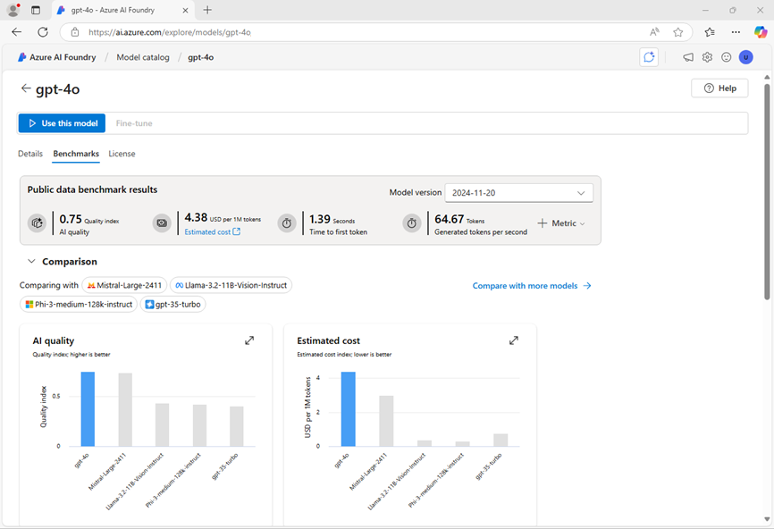

---
lab:
  title: Auswählen und Bereitstellen eines Sprachmodells
  description: 'Generative KI-Anwendungen basieren auf einem oder mehreren Sprachmodellen. Erfahren Sie, wie Sie geeignete Modelle für Ihr generatives KI-Projekt finden und auswählen.'
---

# Auswählen und Bereitstellen eines Sprachmodells

Der Modellkatalog von Azure KI Foundry dient als zentrales Repository, in dem Sie eine Vielzahl von Modellen erforschen und verwenden können, was die Erstellung Ihres generativen KI-Szenarios erleichtert.

In dieser Übung erkunden Sie den Modellkatalog im Azure AI Foundry-Portal und vergleichen potenzielle Modelle für eine generative KI-Anwendung, die bei der Lösung von Problemen hilft.

Diese Übung dauert ungefähr **25** Minuten.

## Erstellen eines Azure KI-Hubs und eines Projekts

Ein Azure KI-Hub bietet einen Arbeitsbereich für die Zusammenarbeit, in dem Sie ein oder mehrere *Projekte* definieren können. Erstellen Sie uns ein Projekt und ein Azure KI-Hub.

1. Öffnen Sie in einem Webbrowser unter `https://ai.azure.com` das [Azure KI Foundry-Portal](https://ai.azure.com) und melden Sie sich mit Ihren Azure-Anmeldeinformationen an. Schließen Sie alle Tipps oder Schnellstartbereiche, die beim ersten Anmelden geöffnet werden, und verwenden Sie bei Bedarf das **Azure AI Foundry-Logo** oben links, um zur Startseite zu navigieren, die ähnlich wie die folgende Abbildung aussieht:

    

1. Wählen Sie auf der Startseite **+ Projekt erstellen**.
1. Geben Sie im Assistenten **Projekt erstellen** einen passenden Projektnamen ein (z.B. `my-ai-project`) und wählen Sie, falls ein vorhandener Hub vorgeschlagen wird, die Option zum Erstellen eines neuen. Überprüfen Sie dann die Azure-Ressourcen, die automatisch erstellt werden, um Ihren Hub und Ihr Projekt zu unterstützen.
1. Wählen Sie **Anpassen** aus und legen Sie die folgenden Einstellungen für Ihren Hub fest:
    - **Hubname**: *Ein eindeutiger Name – z. B. `my-ai-hub`.*
    - **Abonnement:** *Geben Sie Ihr Azure-Abonnement an.*
    - **Ressourcengruppe**: *Erstellen Sie eine neue Ressourcengruppe mit einem eindeutigen Namen (z.B. `my-ai-resources`), oder wählen Sie eine bestehende aus.*
    - **Standort**: Wählen Sie **Hilfe bei der Auswahl** aus, wählen Sie dann **gpt-4** im Fenster der Standorthilfe aus und verwenden Sie die empfohlene Region\*.
    - **Verbinden von Azure KI Services oder Azure OpenAI**: *Erstellen Sie eine neue KI Services-Ressource mit einem geeigneten Namen (z.B. `my-ai-services`) oder verwenden Sie eine vorhandene.*
    - **Azure KI-Suche verbinden**: Verbindung überspringen

    > \* Die Modellquoten werden auf der Ebene des Mandanten durch regionale Quoten eingeschränkt. Wenn später in der Übung ein Kontingentlimit erreicht wird, besteht eventuell die Möglichkeit, eine andere Ressource in einer anderen Region zu erstellen.

1. Klicken Sie auf **Weiter**, um Ihre Konfiguration zu überprüfen. Klicken Sie auf **Erstellen** und warten Sie, bis der Vorgang abgeschlossen ist.
1. Sobald Ihr Projekt erstellt wurde, schließen Sie alle angezeigten Tipps und überprüfen Sie die Projektseite im Azure AI Foundry-Portal, die in etwa wie in der folgenden Abbildung aussehen sollte:

    

## Konfigurieren der Azure AI Inference-Dienstbereitstellung

Es gibt mehrere Optionen für die Bereitstellung von Modellen im Azure AI Foundry-Portal. In dieser Übung verwenden Sie die Bereitstellungsoption **Azure KI-Modellinferenz**, die sowohl *Azure OpenAI*-Modelle als auch *Model-as-a-Service*-Modelle aus dem Azure AI Foundry-Modellkatalog unterstützt. Da alle Modelle auf einem gemeinsamen Endpunkt bereitgestellt werden, der von Ihrer Azure AI Services-Ressource gehostet wird, ist es einfach, beim Testen zwischen Modellen zu wechseln, um Verhalten und Leistung zu vergleichen.

1. Verwenden Sie auf der Symbolleiste oben rechts auf der Azure AI Foundry-Projektseite das Symbol **Vorschaufeatures** (📣), um Vorschaufeatures anzuzeigen.
1. Stellen Sie sicher, dass die Funktion **Modelle im Azure KI-Modellinferenz-Service bereitstellen** aktiviert ist. Schließen Sie dann den Bereich **Vorschaufeature**.

## Überprüfen von Modelldetails und Benchmarks

Um Ihnen bei der Auswahl eines Modells zu helfen, können Sie sich die Modellbeschreibungen und Benchmarks ansehen, um festzustellen, welches Modell ihren Anforderungen am besten entspricht.

1. Wählen Sie im Azure KI Foundry-Projektportal im Menübereich auf der linken Seite **Modellkatalog** aus.
1. Suchen Sie auf der Startseite des Modellkatalogs nach `gpt-4`, um das Chat-Abschlussmodell **gpt-4** zu finden.

    

1. Wählen Sie das Modell **gpt-4** aus, um seine Details anzuzeigen. Lesen Sie die Beschreibung, und überprüfen Sie die anderen informationen, die auf der Seite verfügbar sind.

    

1. Zeigen Sie auf der Seite **gpt-4** die Registerkarte **Benchmarks** an, um zu sehen, wie das Modell im Vergleich zu einigen Standardleistungs-Benchmarks bei anderen Modellen abschneidet, die in ähnlichen Szenarien verwendet werden.

    

1. Verwenden Sie den Pfeil „Zurück“ (**&larr;**) neben dem Seitentitel **gpt-4**, um zur Startseite des Modellkatalogs zurückzukehren.
1. Suchen Sie im Modellkatalog nach `Phi-3.5-mini-instruct` und sehen Sie sich die Details und Benchmarks für das Modell **Phi-3.5-mini-instruct** an.

## Vergleichen von Modellen

Sie haben zwei verschiedene Modelle überprüft, von denen beide verwendet werden können, um eine generative KI-Chatanwendung zu implementieren. Jetzt vergleichen wir die Metriken für diese beiden Modelle visuell.

1. Kehren Sie zur Startseite des **Modellkatalogs** zurück.
1. Wählen Sie **Modelle vergleichen** aus. Ein visuelles Diagramm für den Modellvergleich wird mit einer Auswahl gängiger Modelle angezeigt.

    

1. Beachten Sie im Bereich **Modelle zum Vergleichen** auf der linken Seite, dass Sie beliebte Aufgaben auswählen können, z. B. *Fragen und Antworten*, um automatisch häufig verwendete Modelle für bestimmte Aufgaben auszuwählen.
1. Verwenden Sie das Symbol **Alle Modelle löschen** (&#128465;), um alle vordefinierten Modelle zu entfernen.
1. Verwenden Sie die Schaltfläche **+Modell zum Vergleichen**, um der Liste das Modell **gpt-4** hinzuzufügen. Verwenden Sie dann dieselbe Schaltfläche, um der Liste das Modell **Phi-3.5-mini-instruct** hinzuzufügen.
1. Überprüfen Sie das Diagramm, das die Modelle basierend auf dem **Qualitätsindex** (eine standardisierte Bewertung, die die Modellqualität angibt) und den **Kosten** vergleicht. Sie können die spezifischen Werte für ein Modell anzeigen, indem Sie den Mauszeiger über den entsprechenden Punkt im Diagramm bewegen.

    

1. Wählen Sie im Dropdown-Menü **X-Achse** unter **Qualität** die folgenden Metriken aus und betrachten Sie jedes resultierende Diagramm, bevor Sie zum nächsten wechseln:
    - Genauigkeit
    - Kohärenz
    - Geläufigkeit
    - Relevance

## Bereitstellen von Modellen

Nachdem Sie Ihre Optionen nun mithilfe von Modell-Benchmarks untersucht haben, können Sie Sprachmodelle bereitstellen. Sie können den Modellkatalog durchsuchen und von dort aus bereitstellen oder ein Modell über die Seite**Bereitstellungen** zur Verfügung stellen. Lassen Sie uns beide Optionen erkunden.

### Bereitstellen eines Modells aus dem *Modellkatalog*

Beginnen wir mit der Bereitstellung eines Modells aus dem Modellkatalog. Sie können diese Option bevorzugen, wenn Sie verschiedene verfügbare Modelle prüfen möchten.

1. Kehren Sie zur Startseite des **Modellkatalogs** zurück.
1. Suchen Sie wie zuvor das `gpt-4` Modell und wählen Sie es aus.
1. Wählen Sie auf der Seite **gpt-4** die Option **Bereitstellen** aus und stellen Sie das Modell mit den folgenden Einstellungen bereit, indem Sie in den Bereitstellungsdetails die Option **Anpassen** auswählen:
1. Stellen Sie das Modell mit den folgenden Einstellungen bereit, indem Sie **Anpassen** in den Bereitstellungsdetails wählen:
    - **Bereitstellungsname**: *Ein eindeutiger Name für Ihre Modellbereitstellung, zum Beispiel `gpt-4`.*
    - **Bereitstellungstyp**: Standard
    - **Modellversion**: 0613
    - **Verbundene AI-Ressource**: *Wählen Sie Ihre Azure OpenAI-Ressourcenverbindung*
    - **Ratenbegrenzung für Token pro Minute (Tausender)**: 5.000
    - **Inhaltsfilter**: StandardV2 
    - **Dynamische Quote aktivieren**: Deaktiviert
      
    > **Hinweis:** Durch das Verringern des TPM wird die Überlastung des Kontingents vermieden, das in dem von Ihnen verwendeten Abonnement verfügbar ist. 5.000 TPM reicht für die in dieser Übung verwendeten Daten aus.

1. Warten Sie, bis die Bereitstellung abgeschlossen ist.

### Bereitstellen eines Modells über *Modelle + Endpunkte*

Wenn Sie bereits genau wissen, welches Modell Sie bereitstellen möchten, ziehen Sie es vielleicht vor, dies über **Modelle + Endpunkte** zu tun.

1. Wählen Sie in der Navigationsleiste auf der linken Seite im Bereich **Meine Assets** die Option **Modelle + Endpunkte** aus.
1. Wählen Sie auf der Registerkarte **Modellbereitstellungen** in der Dropdownliste **+ Modell bereitstellen** die Option **Basismodell bereitstellen** aus. Suchen Sie dann nach `Phi-3.5-mini-instruct` und bestätigen Sie Ihre Auswahl.
1. Stimmen Sie der Modelllizenz zu.
1. Stellen Sie ein **Phi-3.5-mini-instruct** -Modell mit den folgenden Einstellungen bereit:
    - **Bereitstellungsname**: *Ein eindeutiger Name für Ihre Modellbereitstellung, zum Beispiel `Phi-3.5-mini-instruct`*
    - **Bereitstellungstyp**: Globaler Standard
    - **Bereitstellungsdetails**: *Verwenden der Standardeinstellungen.*

1. Warten Sie, bis die Bereitstellung abgeschlossen ist.

## Testen von Modellen im Chat-Playground

Nachdem wir nun zwei Modelle zum Vergleichen haben, sehen wir uns an, wie sich die Modelle in einer Unterhaltungsinteraktion verhalten.

### Vorbereiten des Chats

1. Wählen Sie in der Navigationsleiste **Playgrounds** aus. Wählen Sie dann den **Chatplayground** aus.
1. Legen Sie im Bereich **Setup** im Feld **Dem Modell Anweisungen und Kontext geben** die Systemansage auf `You are an AI assistant that helps solve problems.` fest
1. Wählen Sie **Änderungen übernehmen** aus.

### Chatten mit dem *gpt-4*-Modell

Wählen Sie im Bereich **Setup** Ihr *gpt-4*-Modell aus.
1. Geben Sie im Chatfenster die folgende Abfrage ein:

    ```
    I have a fox, a chicken, and a bag of grain that I need to take over a river in a boat. I can only take one thing at a time. If I leave the chicken and the grain unattended, the chicken will eat the grain. If I leave the fox and the chicken unattended, the fox will eat the chicken. How can I get all three things across the river without anything being eaten?
    ```

1. Zeigen Sie die Antwort an. Geben Sie dann die folgende Nachverfolgungsabfrage ein:

    ```
    Explain your reasoning.
    ```

### Chatten mit dem *Phi-3.5*-Modell

1. Wählen Sie im Bereich **Setup** Ihr *Phi-3.5*-Modell aus.
1. Stellen Sie sicher, dass eine neue Chatsitzung gestartet wird, bevor Sie die gleichen Prompts wiederholen, die Sie zuvor zum Testen des gpt-4-Modells verwendet haben.
1. Geben Sie im Chatfenster die folgende Abfrage ein:

    ```
    I have a fox, a chicken, and a bag of grain that I need to take over a river in a boat. I can only take one thing at a time. If I leave the chicken and the grain unattended, the chicken will eat the grain. If I leave the fox and the chicken unattended, the fox will eat the chicken. How can I get all three things across the river without anything being eaten?
    ```

1. Zeigen Sie die Antwort an. Geben Sie dann die folgende Nachverfolgungsabfrage ein:

    ```
    Explain your reasoning.
    ```

### Durchführen eines weiteren Vergleichs

1. Probieren Sie das folgende Puzzle mit beiden Modellen aus, bitten Sie die Modelle, ihre Begründung zu erklären (die richtige Antwort ist 40!):

    ```
    I have 53 socks in my drawer: 21 identical blue, 15 identical black and 17 identical red. The lights are out, and it is completely dark. How many socks must I take out to make 100 percent certain I have at least one pair of black socks?
    ```

## Reflektieren der Modelle

Sie haben zwei Modelle verglichen, die sich sowohl in ihrer Fähigkeit, angemessene Reaktionen zu generieren, als auch in ihren Kosten unterscheiden können. In jedem generativen Szenario müssen Sie ein Modell finden, das die richtige Balance zwischen der Eignung für die Aufgabe, die Sie ihm übertragen möchten, und den Kosten für die Nutzung des Modells für die Anzahl der Anfragen, die es voraussichtlich bearbeiten muss, bietet.

Die im Modellkatalog enthaltenen Details und Benchmarks sowie die Möglichkeit, Modelle visuell zu vergleichen, bieten einen nützlichen Ausgangspunkt für die Identifizierung von Kandidatenmodellen für eine generative KI-Lösung. Anschließend können Sie Kandidatenmodelle mit einer Vielzahl von System- und Benutzerprompts im Chat-Playground testen.

## Bereinigen

Wenn Sie die Erkundung des Azure KI-Foundry-Portals abgeschlossen haben, sollten Sie die Ressourcen, die Sie in dieser Übung erstellt haben, löschen, um unnötige Azure-Kosten zu vermeiden.

1. Öffnen Sie das [Azure-Portal](https://portal.azure.com), und zeigen Sie den Inhalt der Ressourcengruppe an, in der Sie die in dieser Übung verwendeten Ressourcen bereitgestellt haben.
1. Wählen Sie auf der Symbolleiste die Option **Ressourcengruppe löschen** aus.
1. Geben Sie den Namen der Ressourcengruppe ein, und bestätigen Sie, dass Sie sie löschen möchten.
