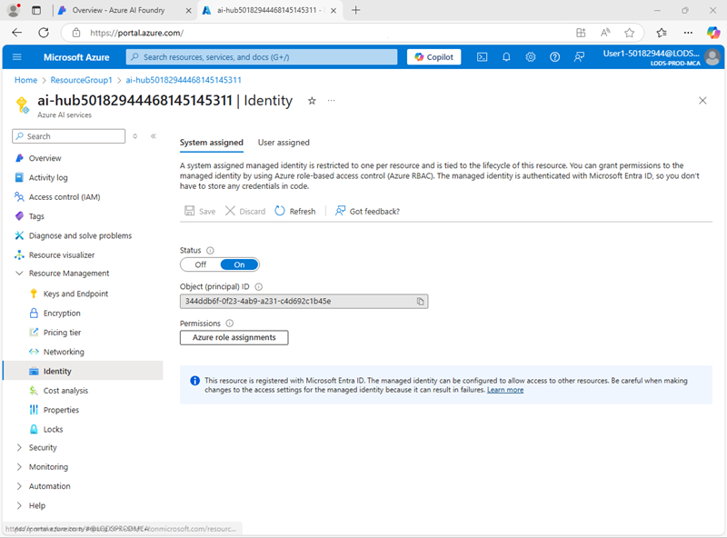
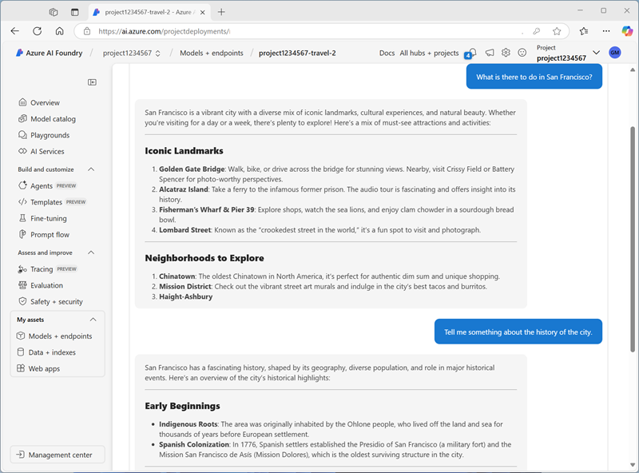

---
lab:
  title: Verwenden eines Prompt Flows zur Verwaltung von Konversationen in einer Chat-App
  description: 'Erfahren Sie, wie Sie Prompt Flows verwenden, um Konversationsdialoge zu verwalten und sicherzustellen, dass Prompts für optimale Ergebnisse konstruiert und orchestriert werden.'
---

## Verwenden eines Prompt Flows zur Verwaltung von Konversationen in einer Chat-App

In dieser Übung verwenden Sie den Prompt-Flow des Azure KI Foundry-Portals, um eine benutzerdefinierte Chat-App zu erstellen, die einen Benutzerprompt und einen Chatverlauf als Eingaben verwendet und ein GPT-Modell von Azure OpenAI nutzt, um eine Ausgabe zu erzeugen.

Diese Übung dauert ungefähr **30** Minuten.

> **Hinweis**: Einige der in dieser Übung verwendeten Technologien befinden sich in der Vorschau oder in der aktiven Entwicklung. Es kann zu unerwartetem Verhalten, Warnungen oder Fehlern kommen.

## Erstellen eines Azure AI Foundry-Hubs und -Projekts

Die Funktionen von Azure KI-Foundry, die wir in dieser Übung verwenden werden, erfordern ein Projekt, das auf einer Azure KI-Foundry-*Hub*-Ressource basiert.

1. Öffnen Sie in einem Webbrowser unter `https://ai.azure.com` das [Azure KI Foundry-Portal](https://ai.azure.com) und melden Sie sich mit Ihren Azure-Anmeldeinformationen an. Schließen Sie alle Tipps oder Schnellstartfenster, die bei der ersten Anmeldung geöffnet werden, und verwenden Sie gegebenenfalls das Logo **Azure AI Foundry** oben links, um zur Startseite zu navigieren, die ähnlich wie die folgende Abbildung aussieht (schließen Sie das **Hilfe**-Fenster, falls es geöffnet ist):

    

1. Navigieren Sie im Browser zu `https://ai.azure.com/managementCenter/allResources`, und wählen Sie **Neu erstellen** aus. Wählen Sie dann die Option zum Erstellen einer neuen **KI-Hubressource** aus.
1. Geben Sie im Assistenten zum **Erstellen eines Projekts** einen gültigen Namen für Ihr Projekt ein und wählen Sie die Option zum Erstellen eines neuen Hubs aus. Verwenden Sie anschließend den Link **Hub umbenennen**, um einen gültigen Namen für Ihren neuen Hub anzugeben, erweitern Sie **Erweiterte Optionen** und legen Sie die folgenden Einstellungen für Ihr Projekt fest:
    - **Abonnement:** *Geben Sie Ihr Azure-Abonnement an.*
    - **Ressourcengruppe**: *Erstellen Sie eine Ressourcengruppe, oder wählen Sie eine Ressourcengruppe aus*.
    - **Region**: USA, Osten 2 oder Schweden-Mitte (*Falls später im Verlauf der Übung eine Kontingentgrenze überschritten wird, müssen Sie möglicherweise eine weitere Ressource in einer anderen Region erstellen.*)

    > **Hinweis**: Wenn Sie in einem Azure-Abonnement arbeiten, in dem Richtlinien zur Einschränkung zulässiger Ressourcennamen verwendet werden, müssen Sie möglicherweise den Link unten im Dialogfeld **Neues Projekt erstellen** verwenden, um den Hub über das Azure-Portal zu erstellen.

    > **Hinweis**: Wenn die Schaltfläche **Erstellen** weiterhin deaktiviert ist, benennen Sie Ihren Hub bitte in einen eindeutigen alphanumerischen Wert um.

1. Warten Sie, bis Ihr Projekt erstellt wurde.

## Konfigurieren der Ressourcenautorisierung

Die Prompt Flow Tools in Azure AI Foundry erstellen dateibasierte Assets, die den Prompt Flow in einem Ordner im Blob Storage definieren. Bevor wir uns mit dem Prompt-Flow befassen, stellen Sie sicher, dass Ihre Azure AI Foundry-Ressource über die erforderlichen Zugriffsrechte für den Blob-Speicher verfügt, damit sie diese lesen kann.

1. Öffnen Sie in einem neuen Browser-Tab das [Azure-Portal](https://portal.azure.com) unter `https://portal.azure.com`, melden Sie sich bei Aufforderung mit Ihren Azure-Anmeldeinformationen an, und zeigen Sie die Ressourcengruppe an, die Ihre Azure KI Hub-Ressourcen enthält.
1. Wählen Sie die Ressource **Azure AI Foundry** für Ihren Hub aus, um sie zu öffnen. Erweitern Sie anschließend den Abschnitt **Ressourcenverwaltung** und wählen Sie die Seite **Identität** aus:

    

1. Wenn der Status der vom System zugewiesenen Identität **Aus** ist, schalten Sie sie **Ein** und speichern Sie Ihre Änderungen. Warten Sie dann, bis die Änderung des Status bestätigt wurde.
1. Kehren Sie zur Ressourcengruppenseite zurück, wählen Sie die Ressource **Speicherkonto** für Ihren Hub aus und zeigen Sie die Seite **Zugriffssteuerung (IAM)** an:

    

1. Fügen Sie der Rolle `Storage blob data reader` eine Rollenzuweisung für die verwaltete Identität hinzu, die von Ihrer Azure AI Foundry-Ressource verwendet wird:

    

1. Wenn Sie den Rollenzugriff überprüft und zugewiesen haben, damit die von Azure AI Foundry verwaltete Identität Blobs im Speicherkonto lesen kann, schließen Sie die Registerkarte des Azure-Portals und kehren Sie zum Azure AI Foundry-Portal zurück.

## Bereitstellen eines generativen KI-Modells

Jetzt sind Sie bereit, ein generatives KI-Sprachmodell zur Unterstützung Ihrer Prompt-Flow-Anwendung einzusetzen.

1. Wählen Sie im linken Fensterbereich für Ihr Projekt im Abschnitt **Meine Assets** die Seite **Modelle + Endpunkte**.
1. Wählen Sie auf der Seite **Modelle + Endpunkte** auf der Registerkarte **Modellbereitstellungen** im Menü **+ Modell bereitstellen** die Option **Basismodell bereitstellen**.
1. Suchen Sie das Modell **gpt-4o** in der Liste, wählen Sie es aus und bestätigen Sie es.
1. Stellen Sie das Modell mit den folgenden Einstellungen bereit, indem Sie **Anpassen** in den Bereitstellungsdetails wählen:
    - **Bereitstellungsname:***Ein eindeutiger Name für die Modellimplementierung*
    - **Bereitstellungstyp**: Globaler Standard
    - **Automatische Versionsaktualisierung**: Aktiviert
    - **Modellversion**: *Wählen Sie die neueste verfügbare Version aus.*
    - **Verbundene AI-Ressource**: *Wählen Sie Ihre Azure OpenAI-Ressourcenverbindung*
    - **Tokens pro Minute Ratenlimit (Tausende)**: 50K *(oder das in Ihrem Abonnement verfügbare Maximum, wenn weniger als 50K)*
    - **Inhaltsfilter**: StandardV2 

    > **Hinweis:** Durch das Verringern des TPM wird die Überlastung des Kontingents vermieden, das in dem von Ihnen verwendeten Abonnement verfügbar ist. 50.000 TPM sollten für die in dieser Übung verwendeten Daten ausreichend sein. Wenn Ihr verfügbares Kontingent darunter liegt, können Sie die Übung zwar durchführen, aber es können Fehler auftreten, wenn das Kontingent überschritten wird.

1. Warten Sie, bis die Bereitstellung abgeschlossen ist.

## Erstellen eines Prompt Flows

Ein Prompt Flow bietet eine Möglichkeit, Prompts und andere Aktivitäten zu orchestrieren, um eine Interaktion mit einem generativen KI-Modell zu definieren. In dieser Übung verwenden Sie eine Vorlage, um einen einfachen Chat Flow für einen KI-Assistenten in einem Reisebüro zu erstellen.

1. Wählen Sie in der Navigationsleiste des Azure AI Foundry-Portals im Abschnitt **Erstellen und Anpassen** die Option **Prompt Flow**.
1. Erstellen Sie einen neuen Flow auf der Grundlage der Vorlage **Chat Flow** und geben Sie `Travel-Chat` als Ordnernamen an.

    Ein einfacher Chatflow wird für Sie erstellt.

    > **Tipp**: Wenn ein Berechtigungsfehler auftritt. Warten Sie einige Minuten, und versuchen Sie es erneut, und geben Sie ggf. einen anderen Flownamen an.

1. Um Ihren Flow testen zu können, benötigen Sie einen Rechner, und es kann eine Weile dauern, bis er startet. Wählen Sie daher **Compute-Sitzung starten**, um ihn zu starten, während Sie den Standard-Flow untersuchen und ändern.

1. Sehen Sie sich den Prompt Flow an, der aus einer Reihe von *Eingaben*, *Ausgaben* und *Tools* besteht. Sie können die Eigenschaften dieser Objekte in den Bearbeitungsbereichen auf der linken Seite erweitern und bearbeiten und den Gesamtflow als Diagramm auf der rechten Seite anzeigen:

    

1. Sehen Sie sich den Bereich **Eingaben** an und stellen Sie fest, dass es zwei Eingaben gibt (Chatverlauf und die Frage der benutzenden Person)
1. Sehen Sie sich den Bereich **Ausgaben** an und stellen Sie fest, dass es eine Ausgabe gibt, die die Antwort des Modells wiedergibt.
1. Zeigen Sie den LLM-Toolbereich **Chat** an, der die Informationen enthält, die zum Übermitteln einer Eingabeaufforderung an das Modell erforderlich sind.
1. Wählen Sie im **Chat** LLM-Toolbereich für **Verbindung** die Verbindung für die Azure OpenAI-Service-Ressource in Ihrem KI-Hub aus. Konfigurieren Sie dann die folgenden Verbindungseigenschaften:
    - **API**: Chat
    - **deployment_name**: *Das von Ihnen bereitgestellte Modell gpt-4o*
    - **response_format**: {"type":"text"}
1. Ändern Sie das Feld **Prompt** wie folgt:

   ```yml
   # system:
   **Objective**: Assist users with travel-related inquiries, offering tips, advice, and recommendations as a knowledgeable travel agent.

   **Capabilities**:
   - Provide up-to-date travel information, including destinations, accommodations, transportation, and local attractions.
   - Offer personalized travel suggestions based on user preferences, budget, and travel dates.
   - Share tips on packing, safety, and navigating travel disruptions.
   - Help with itinerary planning, including optimal routes and must-see landmarks.
   - Answer common travel questions and provide solutions to potential travel issues.

   **Instructions**:
   1. Engage with the user in a friendly and professional manner, as a travel agent would.
   2. Use available resources to provide accurate and relevant travel information.
   3. Tailor responses to the user's specific travel needs and interests.
   4. Ensure recommendations are practical and consider the user's safety and comfort.
   5. Encourage the user to ask follow-up questions for further assistance.

   
   # user:
   {{item.inputs.question}}
   # assistant:
   {{item.outputs.answer}}
   

   # user:
   {{question}}
   ```

    Lesen Sie die Von Ihnen hinzugefügte Eingabeaufforderung, damit Sie damit vertraut sind. Sie besteht aus einer Systemnachricht (die ein Ziel, eine Definition der Fähigkeiten und einige Anweisungen enthält) und dem Chatverlauf (geordnet, um jede von der benutzenden Person eingegebene Frage und jede vorhergehende Antwort des Assistenten anzuzeigen)

1. Im Abschnitt **Eingaben** für das LLM-Tool **Chat** (unter der Eingabeaufforderung), stellen Sie sicher, dass die folgenden Variablen gesetzt sind:
    - **question** (string): ${inputs.question}
    - **chat_history** (string): ${inputs.chat_history}

1. Sichern Sie die Änderungen am Flow.

    > **Hinweis**: In dieser Übung beschränken wir uns auf einen einfachen Chat Flow. Beachten Sie jedoch, dass der Editor für den Prompt Flow viele weitere Tools enthält, die Sie dem Ablauf hinzufügen können, um eine komplexe Logik zur Orchestrierung von Unterhaltungen zu erstellen.

## Testen des Flows

Nachdem Sie nun den Flow bereitgestellt haben, können Sie ihn im Chatfenster testen.

1. Stellen Sie sicher, dass die Computesitzung ausgeführt wird. Wenn nicht, warten Sie, bis er startet.
1. Wählen Sie in der Symbolleiste **Chat**, um den Bereich **Chat** zu öffnen, und warten Sie, bis der Chat initialisiert ist.
1. Geben Sie die Abfrage ein: `I have one day in London, what should I do?`. Überprüfen Sie dann die Ausgabe. Der Chatbereich sollte in etwa so aussehen:

    

## Bereitstellen des Flows

Wenn Sie mit dem Verhalten des von Ihnen erstellten Flows zufrieden sind, können Sie ihn bereitstellen.

> **Hinweis**: Die Bereitstellung kann lange dauern und kann durch Kapazitätsbeschränkungen in Ihrem Abonnement oder Mandanten beeinträchtigt werden.

1. Wählen Sie in der Symbolleiste **Bereitstellen** und setzen Sie den Flow mit den folgenden Einstellungen ein:
    - **Grundeinstellungen**:
        - **Endpunkt**: Neu
        - **Endpunktname**: *Geben Sie einen eindeutigen Namen ein.*
        - **Bereitstellungsname**: *Geben Sie einen eindeutigen Namen ein.*
        - **VM**: Standard_DS3_v2
        - **Instanzenanzahl**: 1
        - **Rückschließen Datensammlung**: Deaktiviert
    - **Erweiterte Einstellungen**:
        - *Verwenden der Standardeinstellungen*
1. Wählen Sie im Azure AI Foundry-Portal im Navigationsbereich im Abschnitt **Meine Assets** die Seite **Modelle + Endpunkte**.

    Wenn sich die Seite für Ihr gpt-4o-Modell öffnet, verwenden Sie die Schaltfläche **zurück**, um alle Modelle und Endpunkte anzuzeigen.

1. Zu Beginn zeigt die Seite möglicherweise nur Ihre Modellbereitstellungen an. Es kann einige Zeit dauern, bis die Bereitstellung aufgelistet wird, und noch länger, bis sie erfolgreich erstellt ist.
1. Wenn die Bereitstellung *erfolgreich* war, wählen Sie sie aus. Zeigen Sie dann die Seite **Test** an.

    > **Tipp**: Wenn die Testseite den Endpunkt als ungesund beschreibt, kehren Sie zu den **Modellen und Endpunkten** zurück und warten Sie etwa eine Minute, bevor Sie die Ansicht aktualisieren und den Endpunkt erneut auswählen.

1. Geben Sie den Prompt `What is there to do in San Francisco?` ein und überprüfen Sie die Antwort.
1. Geben Sie den Prompt `Tell me something about the history of the city.` ein und überprüfen Sie die Antwort.

    Der Testbereich sollte in etwa so aussehen:

    

1. Sehen Sie sich die Seite **Verbrauchen** für den Endpunkt an, und beachten Sie, dass sie Verbindungsinformationen und Beispielcode enthält, mit dem Sie eine Client-Anwendung für Ihren Endpunkt erstellen können - so können Sie die Prompt Flow-Lösung als generative KI-Anwendung in eine Anwendung integrieren.

## Bereinigen

Wenn Sie die Untersuchung des Prompt-Flows abgeschlossen haben, sollten Sie die erstellten Ressourcen löschen, um unnötige Azure-Kosten zu vermeiden.

- Navigieren Sie zum [Azure-Portal](https://portal.azure.com) unter `https://portal.azure.com`.
- Wählen Sie auf der **Startseite** des Azure-Portals die Option **Ressourcengruppen** aus.
- Wählen Sie die Ressourcengruppe aus, die Sie für diese Übung erstellt haben.
- Wählen Sie oben auf der Seite **Übersicht** für Ihre Ressourcengruppe die Option **Ressourcengruppe löschen** aus.
- Geben Sie den Namen der Ressourcengruppe ein, um zu bestätigen, dass Sie sie löschen möchten, und wählen Sie **Löschen** aus.
