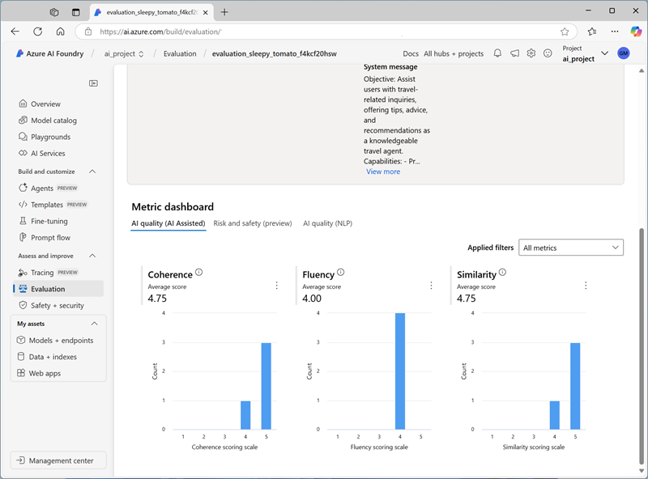

---
lab:
  title: Bewertung der Leistung generativer KI-Modelle
  description: 'Erfahren Sie, wie Sie Modelle und Prompts bewerten können, um die Leistung Ihrer Chat-App und ihre Fähigkeit, angemessen zu reagieren, zu optimieren.'
---

# Bewertung der Leistung generativer KI-Modelle

In dieser Übung werden Sie manuelle und automatische Bewertungen verwenden, um die Leistung eines Modells im Azure AI Foundry-Portal zu bewerten.

Diese Übung dauert ungefähr **30** Minuten.

> **Hinweis**: Einige der in dieser Übung verwendeten Technologien befinden sich in der Vorschau oder in der aktiven Entwicklung. Es kann zu unerwartetem Verhalten, Warnungen oder Fehlern kommen.

## Erstellen eines Azure AI Foundry-Hubs und -Projekts

Die Features von Azure AI Foundry, die wir in dieser Übung verwenden werden, erfordern ein Projekt, das auf einer Azure AI Foundry-*Hub-Ressource* basiert.

1. Öffnen Sie in einem Webbrowser unter `https://ai.azure.com` das [Azure KI Foundry-Portal](https://ai.azure.com) und melden Sie sich mit Ihren Azure-Anmeldeinformationen an. Schließen Sie alle Tipps oder Schnellstartfenster, die bei der ersten Anmeldung geöffnet werden, und verwenden Sie gegebenenfalls das Logo **Azure AI Foundry** oben links, um zur Startseite zu navigieren, die ähnlich wie die folgende Abbildung aussieht (schließen Sie das **Hilfe**-Fenster, falls es geöffnet ist):

    

1. Navigieren Sie im Browser zu `https://ai.azure.com/managementCenter/allResources` und wählen Sie **Erstellen**. Wählen Sie dann die Option zum Erstellen einer neuen **KI-Hubressource** aus.
1. Geben Sie im Assistenten **Projekt erstellen** einen gültigen Namen für Ihr Projekt ein. Wenn ein vorhandener Hub vorgeschlagen wird, wählen Sie die Option zum Erstellen eines neuen Hubs aus und erweitern Sie **Erweiterte Optionen**, um die folgenden Einstellungen für Ihr Projekt festzulegen:
    - **Abonnement:** *Geben Sie Ihr Azure-Abonnement an.*
    - **Ressourcengruppe**: *Erstellen Sie eine Ressourcengruppe, oder wählen Sie eine Ressourcengruppe aus*.
    - **Hubname**: Geben Sie einen gültigen Namen für Ihren Hub an.
    - **Standort**: *Bitte wählen Sie einen der folgenden Standorte aus*:\*
        - USA (Ost) 2
        - Frankreich, Mitte
        - UK, Süden
        - Schweden, Mitte

    > \* Zum Zeitpunkt der Erstellung dieses Berichts unterstützen diese Regionen die Bewertung von KI-Sicherheitsmetriken. Die Modellverfügbarkeit wird durch regionale Kontingente eingeschränkt. Sollte im weiteren Verlauf der Übung eine Kontingentgrenze erreicht werden, besteht die Möglichkeit, dass Sie ein weiteres Projekt in einer anderen Region erstellen müssen.

1. Warten Sie, bis Ihr Projekt erstellt wurde.

## Bereitstellen von Modellen

In dieser Übung bewerten Sie die Leistung eines gpt-4o-mini-Modells. Außerdem verwenden Sie ein gpt-4o-Modell, um KI-unterstützte Auswertungsmetriken zu generieren.

1. Wählen Sie im Navigationsbereich links für Ihr Projekt im Abschnitt **Meine Assets** die Seite **Modelle + Endpunkte**.
1. Wählen Sie auf der Seite **Modelle + Endpunkte** auf der Registerkarte **Modellbereitstellungen** im Menü **+ Modell bereitstellen** die Option **Basismodell bereitstellen**.
1. Suchen Sie das Modell **gpt-4o** in der Liste, wählen Sie es aus und bestätigen Sie es.
1. Stellen Sie das Modell mit den folgenden Einstellungen bereit, indem Sie **Anpassen** in den Bereitstellungsdetails wählen:
    - **Bereitstellungsname:***Ein eindeutiger Name für die Modellimplementierung*
    - **Bereitstellungstyp**: Globaler Standard
    - **Automatische Versionsaktualisierung**: Aktiviert
    - **Modellversion**: *Wählen Sie die neueste verfügbare Version aus.*
    - **Verbundene AI-Ressource**: *Wählen Sie Ihre Azure OpenAI-Ressourcenverbindung*
    - **Tokens pro Minute Ratenlimit (Tausende)**: 50K *(oder das in Ihrem Abonnement verfügbare Maximum, wenn weniger als 50K)*
    - **Inhaltsfilter**: StandardV2 

    > **Hinweis:** Durch das Verringern des TPM wird die Überlastung des Kontingents vermieden, das in dem von Ihnen verwendeten Abonnement verfügbar ist. 50.000 TPM sollten für die in dieser Übung verwendeten Daten ausreichend sein. Wenn Ihr verfügbares Kontingent darunter liegt, können Sie die Übung zwar durchführen, aber es können Fehler auftreten, wenn das Kontingent überschritten wird.

1. Warten Sie, bis die Bereitstellung abgeschlossen ist.
1. Kehren Sie zur Seite **Modelle + Endpunkte** zurück und wiederholen Sie die vorherigen Schritte, um ein **gpt-4o-mini**-Modell mit denselben Einstellungen einzurichten.

## Manuelles Auswerten eines Modells

Sie können Modellantworten basierend auf Testdaten manuell überprüfen. Die manuelle Überprüfung ermöglicht es Ihnen, verschiedene Eingaben zu testen, um zu beurteilen, ob das Modell die erwartete Leistung erbringt.

1. Laden Sie in einem neuen Browser-Tab die Datei [travel_evaluation_data.jsonl](https://raw.githubusercontent.com/MicrosoftLearning/mslearn-ai-studio/refs/heads/main/data/travel_evaluation_data.jsonl) von `https://raw.githubusercontent.com/MicrosoftLearning/mslearn-ai-studio/refs/heads/main/data/travel_evaluation_data.jsonl` herunter und speichern Sie sie in einem lokalen Ordner als **travel_evaluation_data.jsonl** (achten Sie darauf, die Datei als .jsonl-Datei und nicht als .txt-Datei zu speichern).
1. Kehren Sie zur Registerkarte des Azure AI Foundry-Portals zurück, wählen Sie im Navigationsbereich im Abschnitt **Schützen und verwalten** die Option **Auswertung** aus.
1. Wenn das Fenster **Neue Bewertung erstellen** automatisch geöffnet wird, wählen Sie **Abbrechen**, um es zu schließen.
1. Zeigen Sie auf der Seite **Auswertung** die Registerkarte **Manuelle Auswertungen** an und wählen Sie **+ Neue manuelle Auswertung**.
1. Wählen Sie im Abschnitt **Konfigurationen** in der Liste **Modell** Ihre **gpt-4o**-Modellbereitstellung aus.
1. Ändern Sie die **Systemmeldung** in die folgenden Anweisungen für einen KI-Reiseassistenten:

   ```
   Assist users with travel-related inquiries, offering tips, advice, and recommendations as a knowledgeable travel agent.
   ```

1. Wählen Sie im Abschnitt **Manuelles Auswertungsergebnis** die Option **Testdaten importieren** und laden Sie die zuvor heruntergeladene Datei **travel_evaluation_data.jsonl** hoch. Scrollen Sie nach unten, um die Datensatzfelder wie folgt zuzuordnen:
    - **Eingabe**: Frage
    - **Erwartete Antwort**: ExpectedResponse
1. Überprüfen Sie die Fragen und erwarteten Antworten in der Testdatei . Sie verwenden diese, um die vom Modell generierten Antworten auszuwerten.
1. Wählen Sie **Ausführen** in der oberen Leiste aus, um Ausgaben für alle Fragen zu generieren, die Sie als Eingaben hinzugefügt haben. Nach ein paar Minuten sollten die Antworten des Modells in einer neuen Spalte **Ausgabe** angezeigt werden, etwa so:

    

1. Überprüfen Sie die Ausgaben für jede Frage, vergleichen Sie die Ausgabe des Modells mit der erwarteten Antwort und „Bewertung“ der Ergebnisse, indem Sie die Daumen nach oben oder unten rechts in jeder Antwort auswählen.
1. Nachdem Sie die Antworten bewertet haben, überprüfen Sie die Zusammenfassungskacheln oberhalb der Liste. Wählen Sie dann in der Symbolleiste **Ergebnisse speichern** und weisen Sie einen geeigneten Namen zu. Wenn Sie die Ergebnisse speichern, können Sie sie zu einem späteren Zeitpunkt für eine weitere Bewertung oder einen Vergleich mit einem anderen Modell abrufen.

## Automatisierte Bewertung verwenden

Der manuelle Vergleich der Modellausgabe mit den von Ihnen erwarteten Antworten kann zwar eine nützliche Methode sein, um die Leistung eines Modells zu bewerten, ist aber in Szenarien, in denen Sie eine große Bandbreite an Fragen und Antworten erwarten, sehr zeitaufwändig und liefert kaum standardisierte Messwerte, mit denen Sie verschiedene Modell- und Prompt-Kombinationen vergleichen können.

Die automatisierte Bewertung ist ein Ansatz, der versucht, diese Unzulänglichkeiten zu beheben, indem er Metriken berechnet und KI einsetzt, um Antworten auf Kohärenz, Relevanz und andere Faktoren zu bewerten.

1. Verwenden Sie den Zurück-Pfeil (**&larr;**) neben dem Seitentitel **Manuelle Bewertung**, um zur Seite **Bewertung** zurückzukehren.
1. Zeigen sie die Registerkarte **Automatisierte Bewertungen** an.
1. Wählen Sie **Neue Auswertung erstellen** und wählen Sie im Prompt die Option zum Auswerten eines **Modells auswählen** und wählen Sie **Weiter**.
1. Wählen Sie auf der Seite **Datenquelle auswählen** die Option **Eigenen Datensatz verwenden** und wählen Sie den Datensatz **travel_evaluation_data_jsonl_*xxxx...*** basierend auf der zuvor hochgeladenen Datei aus und klicken Sie auf **Weiter**.
1. Wählen Sie auf der Seite **Modell testen** das Modell **gpt-4o-mini** aus und ändern Sie die **Systemmeldung** in die Anweisungen für einen KI-Reiseassistenten, die Sie zuvor verwendet haben:

   ```
   Assist users with travel-related inquiries, offering tips, advice, and recommendations as a knowledgeable travel agent.
   ```

1. Für das Feld **Abfrage** wählen Sie **\{\{item.question\}\}**.
1. Klicken Sie auf **Weiter**, um zur nächsten Seite zu wechseln.
1. Auf der Seite **Gutachterin/Gutachter konfigurieren** fügen Sie über die Schaltfläche **+Hinzufügen** die folgenden Gutachterinnen/Gutachter hinzu und konfigurieren jeden wie folgt:
    - **Modellbewertung**:
        - **Kriterienname**: Semantic_similarity
        - **Bewerten mit**: *Wählen Sie Ihr **gpt-4o**-Modell aus*
        - **Benutzer**-Einstellungen (unten):


            Ausgabe: \{\{sample.output_text\}\}<br>
            Grundwahrheit: \{\{item.ExpectedResponse\}\}<br>
            <br>
        
    - **Likert-Scale-Evaluator**:
        - **Kriterienname**: Relevanz
        - **Bewerten mit**: *Wählen Sie Ihr **gpt-4o**-Modell aus*
        - **Abfrage**: \{\{item.question\}\}

    - **Ähnlichkeit des Texts**:
        - **Kriterienname**: F1_Score
        - **Grundwahrheit**: \{\{item. ExpectedResponse\}\}

    - **Hasserfüllte und unfaire Inhalte**:
        - **Kriterienname**: Hate_and_unfairness
        - **Abfrage**: \{\{item.question\}\}

1. Wählen Sie **Weiter** und überprüfen Sie Ihre Bewertungseinstellungen. Sie sollten die Auswertung so konfiguriert haben, dass der Datensatz für die Reiseauswertung verwendet wird, um das Modell **gpt-4o-mini** hinsichtlich semantischer Ähnlichkeit, Relevanz, F1-Score sowie hasserfüllter und unfairer Sprache zu bewerten.
1. Geben Sie der Auswertung einen geeigneten Namen, und **übermitteln Sie** sie, um den Auswertungsprozess zu starten, und warten Sie, bis der Vorgang abgeschlossen ist. Dies kann einige Minuten dauern. Sie können die Schaltfläche **Aktualisieren** in der Symbolleiste verwenden, um den Status zu überprüfen.

1. Wenn die Auswertung abgeschlossen ist, scrollen Sie bei Bedarf nach unten, um die Ergebnisse zu überprüfen.

    

1. Wählen Sie oben auf der Seite die Registerkarte **Daten**, um die Rohdaten der Auswertung anzuzeigen. Die Daten enthalten die Metriken für jede Eingabe sowie Erläuterungen zu den Überlegungen, die das gpt-4o Modell bei der Bewertung der Antworten angestellt hat.

## Bereinigen

Wenn Sie die Erkundung der Azure KI Foundry abgeschlossen haben, sollten Sie die von Ihnen erstellten Ressourcen löschen, um unnötige Azure-Kosten zu vermeiden.

- Navigieren Sie zum [Azure-Portal](https://portal.azure.com) unter `https://portal.azure.com`.
- Wählen Sie auf der **Startseite** des Azure-Portals die Option **Ressourcengruppen** aus.
- Wählen Sie die Ressourcengruppe aus, die Sie für diese Übung erstellt haben.
- Wählen Sie oben auf der Seite **Übersicht** für Ihre Ressourcengruppe die Option **Ressourcengruppe löschen** aus.
- Geben Sie den Namen der Ressourcengruppe ein, um zu bestätigen, dass Sie sie löschen möchten, und wählen Sie **Löschen** aus.
