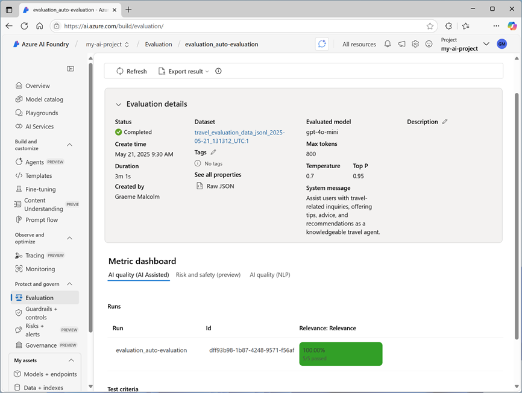

---
lab:
  title: Bewertung der Leistung generativer KI-Modelle
  description: 'Erfahren Sie, wie Sie Modelle und Prompts bewerten können, um die Leistung Ihrer Chat-App und ihre Fähigkeit, angemessen zu reagieren, zu optimieren.'
---

# Bewertung der Leistung generativer KI-Modelle

In dieser Übung werden Sie manuelle und automatische Bewertungen verwenden, um die Leistung eines Modells im Azure AI Foundry-Portal zu bewerten.

Diese Übung dauert ungefähr **30** Minuten.

> **Hinweis**: Einige der in dieser Übung verwendeten Technologien befinden sich in der Vorschau oder in der aktiven Entwicklung. Es kann zu unerwartetem Verhalten, Warnungen oder Fehlern kommen.

## Erstellen eines Azure KI Foundry-Projekts

Beginnen wir mit dem Erstellen eines Azure AI Foundry-Projekts.

1. Öffnen Sie in einem Webbrowser unter `https://ai.azure.com` das [Azure KI Foundry-Portal](https://ai.azure.com) und melden Sie sich mit Ihren Azure-Anmeldeinformationen an. Schließen Sie alle Tipps oder Schnellstartfenster, die bei der ersten Anmeldung geöffnet werden, und verwenden Sie gegebenenfalls das **Azure AI Foundry**-Logo oben links, um zur Startseite zu navigieren, die ähnlich wie die folgende Abbildung aussieht (schließen Sie den Bereich **Hilfe**, falls er geöffnet ist):

    

1. Wählen Sie auf der Startseite **+ Projekt erstellen**.
1. Geben Sie im Assistenten **Projekt erstellen** einen gültigen Namen für Ihr Projekt ein und wählen Sie, falls ein vorhandener Hub vorgeschlagen wird, die Option zum Erstellen eines neuen. Überprüfen Sie dann die Azure-Ressourcen, die automatisch erstellt werden, um Ihren Hub und Ihr Projekt zu unterstützen.
1. Wählen Sie **Anpassen** aus und legen Sie die folgenden Einstellungen für Ihren Hub fest:
    - **Hubname**: *Ein gültiger Name für Ihren Hub*
    - **Abonnement:** *Geben Sie Ihr Azure-Abonnement an.*
    - **Ressourcengruppe**: *Erstellen Sie eine Ressourcengruppe, oder wählen Sie eine Ressourcengruppe aus*
    - **Ort**: Wählen Sie eine der folgenden Regionen\*
        - USA (Ost) 2
        - Frankreich, Mitte
        - UK, Süden
        - Schweden, Mitte
    - **Azure KI Services oder Azure OpenAI verbinden**: *Erstellen Sie eine neue KI-Dienst-Ressource*
    - **Azure KI-Suche verbinden**: Verbindung überspringen

    > \* Zum Zeitpunkt der Erstellung dieses Berichts unterstützen diese Regionen die Bewertung von KI-Sicherheitsmetriken. Die Modellverfügbarkeit wird durch regionale Kontingente eingeschränkt. Sollte im weiteren Verlauf der Übung eine Kontingentgrenze erreicht werden, besteht die Möglichkeit, dass Sie ein weiteres Projekt in einer anderen Region erstellen müssen.

1. Klicken Sie auf **Weiter**, um Ihre Konfiguration zu überprüfen. Klicken Sie auf **Erstellen** und warten Sie, bis der Vorgang abgeschlossen ist.
1. Sobald Ihr Projekt erstellt wurde, schließen Sie alle angezeigten Tipps und überprüfen Sie die Projektseite im Azure AI Foundry-Portal, die in etwa wie in der folgenden Abbildung aussehen sollte:

    

## Bereitstellen von Modellen

In dieser Übung bewerten Sie die Leistung eines gpt-4o-mini-Modells. Außerdem verwenden Sie ein gpt-4o-Modell, um KI-unterstützte Auswertungsmetriken zu generieren.

1. Wählen Sie im Navigationsbereich links für Ihr Projekt im Abschnitt **Meine Assets** die Seite **Modelle + Endpunkte**.
1. Wählen Sie auf der Seite **Modelle + Endpunkte** auf der Registerkarte **Modellbereitstellungen** im Menü **+ Modell bereitstellen** die Option **Basismodell bereitstellen**.
1. Suchen Sie das Modell **gpt-4o** in der Liste, wählen Sie es aus und bestätigen Sie es.
1. Stellen Sie das Modell mit den folgenden Einstellungen bereit, indem Sie **Anpassen** in den Bereitstellungsdetails wählen:
    - **Bereitstellungsname:***Ein eindeutiger Name für die Modellimplementierung*
    - **Bereitstellungstyp**: Globaler Standard
    - **Automatische Versionsaktualisierung**: Aktiviert
    - **Modellversion**: *Wählen Sie die neueste verfügbare Version aus.*
    - **Verbundene AI-Ressource**: *Wählen Sie Ihre Azure OpenAI-Ressourcenverbindung*
    - **Tokens pro Minute Ratenlimit (Tausende)**: 50K *(oder das in Ihrem Abonnement verfügbare Maximum, wenn weniger als 50K)*
    - **Inhaltsfilter**: StandardV2 

    > **Hinweis:** Durch das Verringern des TPM wird die Überlastung des Kontingents vermieden, das in dem von Ihnen verwendeten Abonnement verfügbar ist. 50.000 TPM sollten für die in dieser Übung verwendeten Daten ausreichend sein. Wenn Ihr verfügbares Kontingent darunter liegt, können Sie die Übung zwar durchführen, aber es können Fehler auftreten, wenn das Kontingent überschritten wird.

1. Warten Sie, bis die Bereitstellung abgeschlossen ist.
1. Kehren Sie zur Seite **Modelle + Endpunkte** zurück und wiederholen Sie die vorherigen Schritte, um ein **gpt-4o-mini**-Modell mit denselben Einstellungen einzurichten.

## Manuelles Auswerten eines Modells

Sie können Modellantworten basierend auf Testdaten manuell überprüfen. Die manuelle Überprüfung ermöglicht es Ihnen, verschiedene Eingaben zu testen, um zu beurteilen, ob das Modell die erwartete Leistung erbringt.

1. Laden Sie in einer neuen Browser-Registerkarte die Datei [travel_evaluation_data.csv](https://raw.githubusercontent.com/MicrosoftLearning/mslearn-ai-studio/refs/heads/main/data/travel_evaluation_data.csv) von `https://raw.githubusercontent.com/MicrosoftLearning/mslearn-ai-studio/refs/heads/main/data/travel_evaluation_data.csv` herunter und speichern Sie sie in einem lokalen Ordner.
1. Zurück auf der Registerkarte des Azure AI Foundry-Portals, wählen Sie im Navigationsbereich im Abschnitt **Bewerten und Verbessern** die Option **Bewertung**.
1. Zeigen Sie auf der Seite **Auswertung** die Registerkarte **Manuelle Auswertungen** an und wählen Sie **+ Neue manuelle Auswertung**.
1. Ändern Sie die **Systemmeldung** in die folgenden Anweisungen für einen KI-Reiseassistenten:

   ```
   Objective: Assist users with travel-related inquiries, offering tips, advice, and recommendations as a knowledgeable travel agent.

   Capabilities:
   - Provide up-to-date travel information, including destinations, accommodations, transportation, and local attractions.
   - Offer personalized travel suggestions based on user preferences, budget, and travel dates.
   - Share tips on packing, safety, and navigating travel disruptions.
   - Help with itinerary planning, including optimal routes and must-see landmarks.
   - Answer common travel questions and provide solutions to potential travel issues.
    
   Instructions:
   1. Engage with the user in a friendly and professional manner, as a travel agent would.
   2. Use available resources to provide accurate and relevant travel information.
   3. Tailor responses to the user's specific travel needs and interests.
   4. Ensure recommendations are practical and consider the user's safety and comfort.
   5. Encourage the user to ask follow-up questions for further assistance.
   ```

1. Wählen Sie im Abschnitt **Konfigurationen** in der Liste **Modell** Ihre **gpt-4o-mini**-Modellbereitstellung aus.
1. Wählen Sie im Abschnitt **Manuelles Auswertungsergebnis** die Option **Testdaten importieren** und laden Sie die zuvor heruntergeladene Datei **Travel_evaluation_data.csv** hoch; ordnen Sie die Datensatzfelder wie folgt zu:
    - **Eingabe**: Frage
    - **Erwartete Antwort**: ExpectedResponse
1. Überprüfen Sie die Fragen und erwarteten Antworten in der Testdatei . Sie verwenden diese, um die vom Modell generierten Antworten auszuwerten.
1. Wählen Sie **Ausführen** in der oberen Leiste aus, um Ausgaben für alle Fragen zu generieren, die Sie als Eingaben hinzugefügt haben. Nach ein paar Minuten sollten die Antworten des Modells in einer neuen Spalte **Ausgabe** angezeigt werden, etwa so:

    

1. Überprüfen Sie die Ausgaben für jede Frage, vergleichen Sie die Ausgabe des Modells mit der erwarteten Antwort und „Bewertung“ der Ergebnisse, indem Sie die Daumen nach oben oder unten rechts in jeder Antwort auswählen.
1. Nachdem Sie die Antworten bewertet haben, überprüfen Sie die Zusammenfassungskacheln oberhalb der Liste. Wählen Sie dann in der Symbolleiste **Ergebnisse speichern** und weisen Sie einen geeigneten Namen zu. Wenn Sie die Ergebnisse speichern, können Sie sie zu einem späteren Zeitpunkt für eine weitere Bewertung oder einen Vergleich mit einem anderen Modell abrufen.

## Automatisierte Bewertung verwenden

Der manuelle Vergleich der Modellausgabe mit den von Ihnen erwarteten Antworten kann zwar eine nützliche Methode sein, um die Leistung eines Modells zu bewerten, ist aber in Szenarien, in denen Sie eine große Bandbreite an Fragen und Antworten erwarten, sehr zeitaufwändig und liefert kaum standardisierte Messwerte, mit denen Sie verschiedene Modell- und Prompt-Kombinationen vergleichen können.

Die automatisierte Bewertung ist ein Ansatz, der versucht, diese Unzulänglichkeiten zu beheben, indem er Metriken berechnet und KI einsetzt, um Antworten auf Kohärenz, Relevanz und andere Faktoren zu bewerten.

1. Verwenden Sie den Zurück-Pfeil (**&larr;**) neben dem Seitentitel **Manuelle Bewertung**, um zur Seite **Bewertung** zurückzukehren.
1. Zeigen sie die Registerkarte **Automatisierte Bewertungen** an.
1. Wählen Sie **Eine neue Bewertung erstellen**, und wenn Sie dazu aufgefordert werden, wählen Sie die Option, ein **Modell und eine Eingabeaufforderung** auszuwerten
1. Überprüfen Sie auf der Seite **Erstellen einer neuen Auswertung** im Abschnitt **Grundlegende Informationen** den standardmäßig automatisch generierten Auswertungsnamen (Sie können diesen ändern, wenn Sie möchten) und wählen Sie Ihr **gpt-40-mini** Modell aus.
1. Ändern Sie die **Systemmeldung** in die gleichen Anweisungen für einen KI-Reiseassistenten, die Sie zuvor verwendet haben:

   ```
   Objective: Assist users with travel-related inquiries, offering tips, advice, and recommendations as a knowledgeable travel agent.

   Capabilities:
   - Provide up-to-date travel information, including destinations, accommodations, transportation, and local attractions.
   - Offer personalized travel suggestions based on user preferences, budget, and travel dates.
   - Share tips on packing, safety, and navigating travel disruptions.
   - Help with itinerary planning, including optimal routes and must-see landmarks.
   - Answer common travel questions and provide solutions to potential travel issues.
    
   Instructions:
   1. Engage with the user in a friendly and professional manner, as a travel agent would.
   2. Use available resources to provide accurate and relevant travel information.
   3. Tailor responses to the user's specific travel needs and interests.
   4. Ensure recommendations are practical and consider the user's safety and comfort.
   5. Encourage the user to ask follow-up questions for further assistance.
   ```

1. Im Abschnitt **Testdaten konfigurieren** können Sie ein GPT-Modell verwenden, um Testdaten für Sie zu generieren (die Sie dann bearbeiten und ergänzen können, um sie Ihren eigenen Erwartungen anzupassen), einen vorhandenen Datensatz verwenden oder eine Datei hochladen. Wählen Sie in dieser Übung **Vorhandenen Datensatz verwenden** und wählen Sie dann den **Reiseauswertungsdaten_csv_*xxxx...***-Datensatz (der erstellt wurde, als Sie die .csv-Datei zuvor hochgeladen haben).
1. Überprüfen Sie die Beispielzeilen aus dem Datensatz, und wählen Sie dann im Abschnitt **Wählen Sie Ihre Datenspalte** die folgenden Spaltenzuordnungen:
    - **Abfrage**: Frage
    - **Kontext**: *Lassen Sie dies leer. Es wird verwendet, um die „Fundiertheit“ zu bewerten, wenn eine kontextbezogene Datenquelle mit Ihrem Modell verknüpft wird.*
    - **Grundwahrheit**: ExpectedAnswer
1. Im Abschnitt **Wählen Sie aus, was Sie bewerten möchten**, wählen Sie <u>alle</u> der folgenden Bewertungskategorien:
    - KI-Qualität (KI-gestützt)
    - Risiko und Sicherheit (KI-gestützt)
    - KI-Qualität (NLP)
1. Wählen Sie in der Liste **Eine Modellimplementierung als Richter auswählen** Ihr **gpt-4o** Modell aus. Dieses Modell wird verwendet, um die Antworten des ***gpt-4o-mini** Modells auf sprachbezogene Qualität und Standardvergleichsmetriken der generativen KI zu bewerten.
1. Wählen Sie **Erstellen**, um den Bewertungsprozess zu starten, und warten Sie, bis er abgeschlossen ist. Dies kann einige Minuten dauern.

    > **Tipp**: Wenn eine Fehlermeldung erscheint, die darauf hinweist, dass Projektberechtigungen gesetzt werden, warten Sie eine Minute und wählen Sie dann erneut **Erstellen**. Es kann einige Zeit dauern, bis die Ressourcenberechtigungen für ein neu erstelltes Projekt übertragen werden.

1. Wenn die Bewertung abgeschlossen ist, scrollen Sie gegebenenfalls nach unten, um den Bereich **Metriken-Dashboard** zu sehen und die **KI-Qualität (KI-unterstützt)**-Metriken zu betrachten:

    

    Verwenden Sie die Symbole **<sup>(i) </sup>**, um die Metrikdefinitionen anzuzeigen.

1. Auf der Registerkarte **Risiko und Sicherheit** finden Sie die Metriken, die mit potenziell schädlichen Inhalten verbunden sind.
1. Auf der Registerkarte **KI-Qualität (NLP**) finden Sie Standardmetriken für generative KI-Modelle.
1. Scrollen Sie gegebenenfalls zum Anfang der Seite zurück und wählen Sie die Registerkarte **Daten**, um die Rohdaten der Auswertung anzuzeigen. Die Daten enthalten die Metriken für jede Eingabe sowie Erläuterungen zu den Überlegungen, die das gpt-4o Modell bei der Bewertung der Antworten angestellt hat.

    

## Bereinigen

Wenn Sie die Erkundung der Azure KI Foundry abgeschlossen haben, sollten Sie die von Ihnen erstellten Ressourcen löschen, um unnötige Azure-Kosten zu vermeiden.

- Navigieren Sie zum [Azure-Portal](https://portal.azure.com) unter `https://portal.azure.com`.
- Wählen Sie auf der **Startseite** des Azure-Portals die Option **Ressourcengruppen** aus.
- Wählen Sie die Ressourcengruppe aus, die Sie für diese Übung erstellt haben.
- Wählen Sie oben auf der Seite **Übersicht** für Ihre Ressourcengruppe die Option **Ressourcengruppe löschen** aus.
- Geben Sie den Namen der Ressourcengruppe ein, um zu bestätigen, dass Sie sie löschen möchten, und wählen Sie **Löschen** aus.
