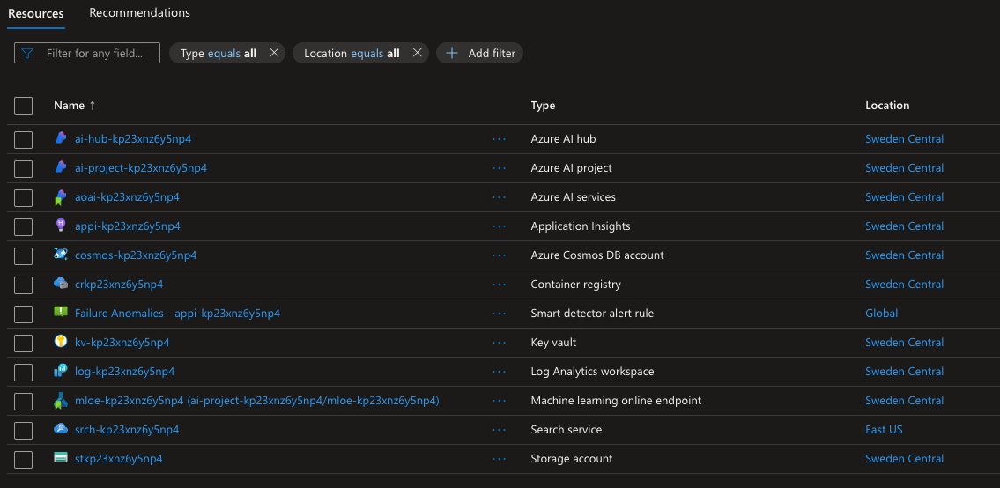
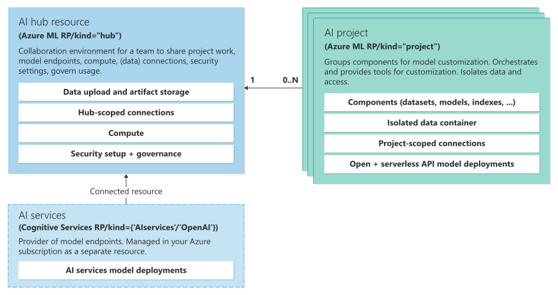
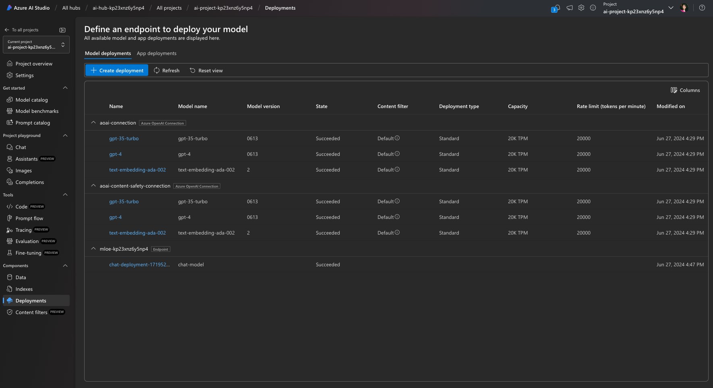

---
lab:
  title: Erstellen eines benutzerdefinierten Kopiloten mit Code-First-Entwicklungstools
---

# Erstellen eines benutzerdefinierten Kopiloten mit Code-First-Entwicklungstools

In dieser Übung klonen und stellen Sie eine Azure Developer CLI-Vorlage bereit, die Ihr KI-Projekt auf Azure KI Foundry bereitstellt und [auf einen Online-Endpunkt](https://learn.microsoft.com/azure/developer/azure-developer-cli/azure-ai-ml-endpoints?WT.mc_id=academic-140829-cacaste) überträgt. Anschließend verwenden Sie ihn als Ausgangspunkt, um Ihren eigenen benutzerdefinierten Copilot mit Azure AI und einer Code-first-Erfahrung zu erstellen.

Diese Übung dauert ungefähr **90** Minuten.

## Vor der Installation

Für diese Übung benötigen Sie Folgendes:

- Ein GitHub-Konto, um das Projekt-Repository zu fälschen und es in einer GitHub Codespaces-Umgebung zu testen. Erstellen Sie ein kostenloses Konto [auf GitHub](https://github.com/).
- Die grundlegende Ebene von Azure AI Search zum Aktivieren des semantischen Rankers. Erfahren Sie mehr über die [Preisdetails von AI Search](https://azure.microsoft.com/pricing/details/search/).
- Zum Bereitstellen von drei OpenAI-Modellen (`gpt-35-turbo`, `gpt-4`, `text-embedding-ada-002`). Um die Modelle einsetzen zu können, müssen Sie den KI-Hub in einer Region mit ausreichender Quote einrichten. Erfahren Sie mehr über die [Modellverfügbarkeit pro Region](https://learn.microsoft.com/azure/ai-services/openai/concepts/models?WT.mc_id=academic-140829-cacaste#model-summary-table-and-region-availability).

## Das Szenario

Um mit der Azure Developer CLI AI-Projektvorlage zu beginnen, navigieren Sie zur [Azure AI-Vorlagen mit Azure Developer CLI-Sammlung](https://learn.microsoft.com/collections/5pq0uompdgje8d/?WT.mc_id=academic-140829-cacaste). In der Sammlung finden Sie verschiedene Projekte, die nach Technologie und Anwendungsfall gruppiert sind, darunter Beispiele für multimodale und Multi-Agenten-Projekte, Copilot-ähnliche Projekte und Beispiele, die verschiedene Frameworks und Azure-Dienste integrieren.

Für diese Übung nehmen Sie die Projektvorlage **[Contoso Chat Retail copilot with Azure AI Foundry & PromptFlow (Python)](https://aka.ms/contoso-retail-sample)** als Ausgangspunkt. Diese Projektvorlage ist eine Code-first-Erfahrung, die Prompty und PromptFlow verwendet, um einen benutzerdefinierten Copilot (Chat AI) zu erstellen, der in die Einzelhandelswebsite (Chat-UI) eines fiktiven Unternehmens namens Contoso Outdoors integriert werden kann.


Die Copilot-Lösung für den Einzelhandel verwendet ein RAG-Muster (Retrieval Augmented Generation), um Antworten auf die Produkt- und Kundendaten des Unternehmens zu stützen. Kunden können den Einzelhandels-Chatbot Fragen zum Produktkatalog des Unternehmens stellen und auch Empfehlungen basierend auf ihren vorherigen Einkäufen erhalten.

Wenn Sie den in der Sammlung enthaltenen Projektlink auswählen, werden Sie an das GitHub-Repository umgeleitet, das den Vorlagencode hostet. Die [README.md](https://github.com/Azure-Samples/contoso-chat/blob/main/README.md) Datei im Repository enthält eine detaillierte Beschreibung des Projekts, einschließlich der Architektur, der Voraussetzungen und der Schritte zur Bereitstellung des Projekts.


## Einrichten von GitHub Codespaces

In dieser Übung verwenden Sie [GitHub Codespaces](https://github.com/features/codespaces), ein GitHub-Feature, mit dem Sie einen vorab konfigurierten cloudgehosteten [Entwicklungscontainer](https://docs.github.com/codespaces/setting-up-your-project-for-codespaces/adding-a-dev-container-configuration/introduction-to-dev-containers) direkt aus Ihrem Repository mit nur einem Klick starten können. Auf diese Weise können Sie schnell mit dem Codieren beginnen, ohne Ihre lokale Entwicklungsumgebung einrichten zu müssen, da die Codespaces bereits alle erforderlichen Tools und Abhängigkeiten vorinstalliert haben.

Führen Sie die folgenden Schritte aus, um Ihre Entwicklungsumgebung zu initialisieren:

1. Navigieren Sie zum **contoso-chat** Projektarchiv: `https://github.com/Azure-Samples/contoso-chat` 
1. Klicken Sie auf die Schaltfläche **Fork** in der oberen rechten Ecke der Contoso-Chat GitHub-Repository-Seite, um eine Kopie des Repositorys in Ihrem GitHub-Konto zu erstellen.
1. Sobald Sie ihr Verzweigungs-Repository haben, wählen Sie den **Code**-Button und dann **"Codespaces"** aus.
1. Wählen Sie die **+** Schaltfläche aus, um einen neuen Codespace im Hauptzweig Ihres Verzweigungs-Repositorys zu erstellen.

    

1. Binnen weniger Sekunden werden Sie zu einer neuen Browser-Registerkarte weitergeleitet, in der die Codespaces-Umgebung standardmäßig mit einem [angeschlossenen Visual Studio Code Editor](https://code.visualstudio.com/docs/devcontainers/containers) eingerichtet ist.

## Verbinden der VS Code-Umgebung mit Azure

Der nächste Schritt ist die Verbindung Ihrer Entwicklungsumgebung mit dem Azure-Abonnement, in dem Sie das Projekt bereitstellen möchten. Öffnen Sie zunächst ein neues Terminal in Ihrer VS Code-Umgebung, die in Codespaces ausgeführt wird.

1. Überprüfen Sie zunächst, ob die [neueste Version](https://github.com/Azure/azure-dev/releases/tag/azure-dev-cli_1.9.3) der Azure Developer CLI installiert ist.
    ```bash
    azd version
    ```

1. Melden Sie sich als Nächstes über den VS Code-Terminal bei Ihrem Azure-Konto an.

    ```bash
    azd auth login 
    ```

## Bereitstellen von Azure-Ressourcen für Ihr Projekt

Sobald Sie angemeldet sind, können Sie mit der Bereitstellung der Azure-Ressourcen für das Projekt in Ihrem Abonnement beginnen. Sie können dies im gleichen VS Code-Terminal tun, das Sie für die Anmeldung verwendet haben.

1. Bereitstellung *und Einsatz* Ihrer KI-Anwendung mit azd.

    ```bash
    azd up
    ```

1. Daraufhin sollte folgende Aufforderung angezeigt werden: Antworten Sie mithilfe der folgenden Anleitung:
    - **Geben Sie einen neuen Umgebungsnamen ein:***Dieser wird zur Erstellung des Namens Ihrer Ressourcengruppe verwendet*.
    - **Wählen Sie ein zu verwendendes Azure-Abonnement aus**: *Wählen Sie ein Abonnement, das Zugriff auf Azure OpenAI-Modelle hat*.
    - **Wählen Sie einen zu verwendenden Azure-Standort aus**: *Wählen Sie einen Standort mit verfügbarem Modellkontingent*.

    > Verwenden Sie die [Modellübersichtstabelle und die regionale Verfügbarkeit](https://learn.microsoft.com/en-us/azure/ai-services/openai/concepts/models?WT.mc_id=academic-140829-cacaste#model-summary-table-and-region-availability), um die gewünschte Region zu finden. Sie können z. B. `sweden central` als Azure-Standort verwenden, da es sich um die Region handelt, in der die meisten Azure OpenAI-Modelle verfügbar sind.

## Validierung der Bereitstellung über das Azure-Portal

Die Bereitstellung einer KI-Anwendung mit azd kann 10 Minuten oder mehr dauern. Sie können den Fortschritt nachverfolgen, indem Sie:

- Den detaillierten Fortschritt im [Azure Portal](https://ms.portal.azure.com/) einsehen. Suchen Sie nach der Ressourcengruppe, die Ihrem Umgebungsnamen entspricht. Wählen Sie die Option **Bereitstellungen** in der Randleiste aus und überwachen Sie dann den Bereitstellungsstatus der zu erstellenden Ressourcen.
- Besuchen Sie das [Azure AI Foundry Portal](https://ai.azure.com). Melden Sie sich mit Ihrem Azure-Konto an. Suchen Sie nach dem KI-Hub, der der oben genannten Ressourcengruppe entspricht (möglicherweise müssen Sie einige Male aktualisieren). Wählen Sie das aufgelistete KI-Projekt aus und wählen Sie **Bereitstellungen** in der Randleiste aus, um den Status für Modelle und Chatanwendungsbereitstellungen nachzuverfolgen.

Sehen wir uns an, wie Sie die Bereitstellung von Ressourcen mithilfe des Azure-Portals überprüfen.

1. Navigieren Sie im Browser zum [Azure-Portal](https://ms.portal.azure.com/).
1. Melden Sie sich an und suchen Sie die Ressourcengruppe, die dem zuvor eingegebenen Abonnement- und Umgebungsnamen entspricht. Der Bereich **Übersicht** sollte wie folgt aussehen:

    

1. Überprüfen Sie zunächst, ob die wichtigsten [Azure AI Foundry Architektur](https://learn.microsoft.com/azure/ai-studio/concepts/architecture)-Ressourcen erstellt wurden. Die folgende Abbildung enthält weitere Details dazu, was jede dieser Ressourcen für unsere KI-Anwendung bereitstellt.

    - **Azure KI-Hub**: Azure-Ressource auf oberster Ebene. Stellt eine Umgebung für die Zusammenarbeit für Teams bereit.
    - **Azure KI-Projekt**: Untergeordnetes Element des Hubs. Gruppiert App-Komponenten für die Orchestrierung, Anpassung.
    - **Azure KI-Dienste**: Verwaltet Ihre Modellendpunkte.

    

1. Als Nächstes stellen wir sicher, dass wir zwei wichtige Ressourcen für die Implementierung unseres Entwurfsmusters für die [erweiterte Abrufgenerierung](https://learn.microsoft.com/azure/ai-studio/concepts/retrieval-augmented-generation) bereitgestellt haben, indem wir die Produkt- und Kundendaten für den abfragegesteuerten Abruf speichern.

    - **Suchdienst**: Zum Verwalten von Suchindizes für unsere Produktkatalogdaten.
    - **Azure Cosmos DB-Konto**: Zum Erstellen einer Datenbank für unsere Kundenauftragsdaten.

1. Als Nächstes können wir überprüfen, ob wir unterstützende Ressourcen für die Verwaltung unserer KI-Anwendungsanforderungen haben:

    - **Application Insights**: Zur Unterstützung der Überwachung und Telemetrie für die bereitgestellte Anwendung.
    - **Containerregistrierung**: Zum privaten Speichern und Verwalten von Docker-Images, die im Projekt verwendet werden.
    - **Key Vault** bietet eine Möglichkeit, Anmeldeinformationen und andere Schlüssel und Geheimnisse sicher zu speichern.
    - **Speicherkonto**: Zum Speichern von Daten im Zusammenhang mit dem KI-Projektmanagement (einschließlich Protokollen).
    - **Smart-Detektor-Warnungsregel**: Application Insights-Anomaliedetektor (für Anforderungen).

1. Zuletzt werden Sie eine neue Ressource mit dem Typ **Machine Learning Onlinebereitstellung** bemerken. Dies ist die Ressource, die unserem bereitgestellten Azure KI-Projektendpunkt (für den Chat-Copilot) entspricht.

## Validieren Sie die Bereitstellung mit Azure KI Foundry

Das Azure-Portal hilft Ihnen, die zugrunde liegenden Azure-Ressourcen für Ihr Projekt zu verwalten. Das Azure KI Foundry Portal hilft Ihnen bei der *Erstellung und Verwaltung* der KI-Projekte selbst, von der Modellauswahl bis zur Bereitstellung der Anwendung. Der Befehl `azd up` sollte den gesamten Prozess von der Bereitstellung erforderlicher Modelle bis zum Bereitstellen und Hosten des Copilot-API-Endpunkts für die Verwendung abgeschlossen haben. Überprüfen wir, ob die Anwendung wie erwartet funktioniert.

1. Besuchen Sie die Seite **Verwalten** im [Azure KI Foundry Portal](https://ai.azure.com/manage), um alle Azure KI Hubs in Ihrem Abonnement anzuzeigen.
1. Wählen Sie den Hub für Ihre Ressourcengruppe aus, um alle Azure KI-Projekte darin anzuzeigen.
1. Wählen Sie das standardmäßige KI-Projekt im Hub aus, und wählen Sie dann **Bereitstellungen** im Menü auf der linken Seite aus.
1. Überprüfen Sie unter **Modellbereitstellungen**, ob Sie über eine Azure OpenAI-Verbindung verfügen, einschließlich der Bereitstellungen von:
    - **gpt-35-turbo**: Wird für den Chatabschluss verwendet und bildet die Kernchat-Engine.
    - **gpt-4**: Wird für die Chatauswertung verwendet, insbesondere KI-unterstützte Flüsse.
    - **text-embedding-ada-002**: Wird für die Abfragevektorisierung und Suche verwendet.
1. Stellen Sie sicher, dass Sie über einen Onlineendpunkt für maschinelles Lernen verfügen, mit:
    - **chat-model**: Chat-KI-Bereitstellung mit Endpunktressource *mloe-xxx*.

    

## Testen der Bereitstellung (in der Cloud) mit Azure KI Foundry

Um zu überprüfen, ob der bereitgestellte Copilot funktioniert, verwenden Sie die integrierte Testspielplatzfunktion im Azure KI Foundry-Portal.


1. Wählen Sie im Azure KI Foundry-Portal aus der Liste **App-Bereitstellungen** die Bereitstellung **chat-deployment-xxxx**.
1. Wählen Sie auf der Seite **Details** der installierten Chat-Anwendung die Registerkarte **Test** aus, um die Testschnittstelle zu erhalten.

    BBeachten Sie, dass die Registerkarte **Details** auch `Target URI`- und `Key`-Werte enthält, die Sie mit anderen Front-End-Anwendungen (z. B. der Contoso Outdoor-Website) verwenden können, um diesen Chat-Assistenten für echte Benutzerinteraktionen zu integrieren.

1. Testen Sie nun die Copilot-Bereitstellung mit der folgenden Test-**Eingabe**:

    ```bash
    {"question": "tell me about your hiking shoes", "customerId": "2", "chat_history": []}
    ```

Sie sollten eine gültige JSON-Antwort in der Ausgabekomponente erhalten, wie dargestellt.


## Testen der Bereitstellung (lokal) mithilfe von Visual Studio Code

Mit dem Befehl **azd up** wird nicht nur die Anwendung auf Azure bereitgestellt, sondern auch *die lokale Umgebung* in Visual Studio Code konfiguriert, um lokale Entwicklung, Tests und Iteration zu unterstützen. Schauen wir uns es an.

1. Überprüfen Sie zunächst, ob Ihre VS Code-Umgebung ordnungsgemäß eingerichtet wurde. Suchen Sie im Stammordner nach einer **config.json** Datei, und stellen Sie sicher, dass sie die drei unten definierten Eigenschaften mit gültigen Werten aufweist.

    ```json
    {
        "subscription_id": "xxxxxxxxxxxxxxxx",
        "resource_group": "rg-xxxxxx",
        "workspace_name": "ai-project-xxxxxxx"
    }

    ```

1. Überprüfen Sie, ob eine **.env**-Datei in Ihrem Stammordner erstellt wurde. Sie sollte eine Liste von Umgebungsvariablen *mit ausgefüllten Werten* enthalten.

    ```bash
    AZUREAI_HUB_NAME=
    AZUREAI_PROJECT_NAME=
    AZURE_CONTAINER_REGISTRY_ENDPOINT=
    AZURE_CONTAINER_REGISTRY_NAME=
    AZURE_COSMOS_NAME=
    AZURE_ENV_NAME=
    AZURE_KEY_VAULT_ENDPOINT=
    AZURE_KEY_VAULT_NAME=
    AZURE_LOCATION=
    AZURE_OPENAI_API_VERSION=
    AZURE_OPENAI_CHAT_DEPLOYMENT=
    AZURE_OPENAI_ENDPOINT=
    AZURE_OPENAI_NAME=
    AZURE_RESOURCE_GROUP=
    AZURE_SEARCH_ENDPOINT=
    AZURE_SEARCH_NAME=
    AZURE_SUBSCRIPTION_ID=
    AZURE_TENANT_ID=
    COSMOS_ENDPOINT=
    ```

1. Stellen Sie sicher, dass die **Promptflow-Tools** in Ihrer Entwicklungsumgebung installiert sind.

    ```bash
    pf version
    ```

1. Verwenden Sie das **Pf Flow-Testtool**, um die **contoso_chat** Flex flow-Anwendung lokal mit der folgenden Beispielfrage zu testen. Beachten Sie die Syntax des Befehls zum Übergeben der Eingaben:

    ```bash
    pf flow test --flow ./contoso_chat --inputs question="tell me about your jackets" customerId="3" chat_history=[]
    ```

Sie sollten eine solche Antwort erhalten:


### Anzeigen von (lokalen) Spuren mit Visual Studio Code

1. Mit dem Flag `--ui` können Sie die Einzelheiten Ihrer Ausführung wie unten gezeigt verfolgen.

    ```bash
    pf flow test --flow ./contoso_chat --inputs question="tell me about your jackets" customerId="3" chat_history=[] --ui
    ```

Dieser Befehl sollte eine **Verfolgungsansicht** in Ihrem Browser (auf einer neuen Registerkarte) mit einer Tabelle aufrufen, die detaillierte Informationen über diesen Testlauf enthält, einschließlich der Latenzzeit und der Verwendung von Token.


1. Wählen Sie den Datensatz aus, um eine detailliertere Trace-Ansicht aufzurufen, in der Sie die Feinheiten des Ablaufs inspizieren können – von den Rohdaten (Eingabe, Ausgabe) bis zu den einzelnen Schritten des Ablaufs und den relevanten Komponenten (z. B. die für LLM verwendeten Prompt-Templates).


## Grundlegendes zur Contoso-Chat-Codebasis

Ihr Azure-Back-End wird bereitgestellt und bereit. Ihre lokale Entwicklungsumgebung ist eingerichtet und für die Arbeit mit Ihrem Azure-Back-End konfiguriert. Jetzt müssen Sie lediglich mit dem Ändern des Inhalts beginnen, um Ihre eigene Version der Anwendung anzupassen und erneut bereitzustellen. Sehen wir uns kurz an, wie die Codebasis strukturiert ist.

> Dies ist eine **vereinfachte Auflistung** des Repositorys, wobei einige Dateien und Ordner aus Gründen der Übersichtlichkeit entfernt wurden.

```bash
data/
    customer_info/  
        create-cosmos-db.ipynb      # Run notebook to upload data to Cosmos DB
        customer_info_1.json        # Example Customer info and orders file
        customer_info_2.json 
        ...
        ...
    product_info/   
        create-azure-search.ipynb   # Run notebook to index product data in AI Search
        products.csv                # Example Products data file

contoso_chat/                       # Main folder for application content
    ai_search.py                    # Search retrieval tool (for RAG design)
    chat.json                       # Example chat file (for Prompty template)
    chat.prompty                    # Chat asset (using Prompty format)
    chat_request.py                 # LLM request tool (for chat completion)
    flow.flex.yaml                  # Promptflow flex flow (define entry point)
    requirements.txt                # App dependencies (define runtime environment)

azure.yaml                          # Main configuration file for Azure Developer CLI  
infra/      
    ai.yaml                         # Define AI model deployments
    app/                            # Infrastructure-as-code config specific to app
    core/                           # Infrastructure-as-code config for core resources
    hooks/                          # Contains post-provisioning scripts
    main.bicep                      # Entry point for Bicep template used by azd
deployment/                         # ai.endpoint config files (named in azure.yaml)
    chat-deployment.yaml 
    chat-model.yaml  
    environment.yaml  

requirements.txt
```

Wenn Sie den Code anpassen möchten:

- Wenn Sie App-Änderungen vornehmen (in `contoso_chat/`), führen Sie einfach `azd deploy` aus, um die Anwendung auf das zuvor bereitgestellte Back-End erneut bereitzustellen. Es sind keine zusätzlichen Schritte für die erneute Bereitstellung oder manuelle Eingriffe erforderlich.
- Wenn Sie Änderungen an den Ressourcen (im Ordner `infra/`) vornehmen, führen Sie `azd up` aus, um die Anwendung erneut bereitzustellen und zu verteilen. Das sollte automatisch Ihre früheren Konfigurationswerte aus `.azure/` übernehmen und sie ändern.

## Optional: Anpassen und erneutes Bereitstellen des Copiloten

Es ist an der Zeit, Ihren eigenen benutzerdefinierten Copilot zu erstellen. Hier sind einige Dinge, die Sie erkunden können, um dies auszuprobieren.

Denken Sie für jede dieser Optionen daran:

- Verwenden Sie `azd deploy`, um Ihre Anwendung erneut bereitzustellen, wenn Sie nur den App-Code geändert haben.
- Verwenden Sie `azd up`, um die Anwendung erneut bereitzustellen, wenn Sie die Ressourcenkonfiguration geändert haben.

### Anpassen der Kunden- und Bestellverlaufsdaten

1. Schauen Sie sich die Beispieldaten unter **data/customer_info** an, um einen Eindruck vom Standardschema zu bekommen.
1. Erkunden Sie das **data/create-cosmos-db.ipynb**-Notebook für einen Code-first-Ansatz zur Datenaktualisierung.
1. **Ändern** Sie die Beispieldaten und **starten** Sie das Notebook, um die Standarddatenbank Azure CosmosDB zu ändern.
1. Die Anwendung **erneut bereitstellen**. Testen Sie mit einer Testfrage, um zu überprüfen, ob neue Kundendaten zurückgegeben werden.

### Anpassen der Produktkatalogdaten

1. Schauen Sie sich die Beispieldaten unter **data/product_info/** an, um ein Gefühl für das Standardschema zu bekommen.
1. Entdecken Sie das **create-azure-search.ipynb** Notebook für einen Code-First-Ansatz für Indexaktualisierungen.
1. **Ändern** Sie die Beispieldaten und **führen** Sie das Notebook aus, um die Standardindizes von Azure AI Search zu ändern.
1. Die Anwendung **erneut bereitstellen**. Testen Sie mit einer Testfrage, um zu überprüfen, ob neue Produktdaten zurückgegeben werden.

### Anpassen der Eingabeaufforderungsvorlage

1. Schauen Sie sich die Datei **contoso_chat/chat.prompty** an, um einen Eindruck von der Standardvorlage für die Eingabeaufforderung zu bekommen.
1. Überprüfen Sie die **contoso_chat/chat.json**, um das Beispieldatenschema für Tests zu verstehen.
1. **Ändern Sie** die Vorlage (Systemmeldung, Sicherheit, Dokumentation oder Anweisungen).
1. **Ändern Sie** die Beispieldaten bei Bedarf.
1. **Verwenden Sie** die Promptflow CLI, um den Fluss lokal mit der neuen Eingabeaufforderungsvorlage zu testen.
1. **Installieren und verwenden Sie** die Prompty-Erweiterung, um eine neue Eingabeaufforderungsvorlage von Grund auf neu zu erstellen.

### Erkunden der Auswertung und Staffelungs-Automatisierung

Ersetzen Sie das Testdatenset, das zum Ausführen der App-Auswertungspipeline über GitHub-Aktionen mit Ihren eigenen Daten verwendet wird. Der Testdatensatz befindet sich im Ordner **data** des Projekts und hat das Format **.jsonl**.

1. Ersetzen Sie die Test-Datensatz-Datei durch Ihre eigenen Daten.
1. Führen Sie dann die Evaluierungspipeline aus, indem Sie die Änderungen in den Hauptzweig Ihres verzweigten Repositorys verschieben.

    Die Auswertungspipeline wird automatisch ausgeführt, und Sie können die Ergebnisse auf der Registerkarte GitHub-Aktionen Ihres Repositorys überprüfen.

1. Sie können die Bewertungspipeline anpassen, indem Sie die Datei **evaluate.yaml** im Ordner **.github/workflows** des Projekts und das Skript **evaluations_chat.py** im Ordner **evaluations** ändern.

## Azure-Ressourcen bereinigen und löschen

Dieses Projekt verwendet Modelle und Dienste (z. B. Azure AI Search), die bei langfristiger Nutzung nicht unerhebliche Kosten verursachen können. Wenn Sie diese Azure AI AZD-Vorlage fertig erforscht haben, sollten Sie die erstellten Ressourcen löschen, um unnötige Azure-Kosten zu vermeiden. Sie können dies tun, indem Sie den folgenden Befehl im VS-Code-Terminal ausführen:

```bash
azd down
```

Dadurch werden nicht nur die Schritte für die Bereitstellung und den Einsatz der Anwendung rückgängig gemacht, sondern es werden auch zusätzliche Schritte unternommen, um *Ressourcen zu bereinigen*, die andernfalls im „Soft Delete“-Status gehalten werden könnten, was sich auf Ihre Fähigkeit auswirkt, Ressourcennamen wiederzuverwenden oder Modellkontingente zurückzugewinnen. **Mit diesem Befehl werden Sie während des Herunterfahrens zu diesen Aktionen aufgefordert. Stellen Sie daher sicher, dass Sie richtig** reagieren.
